# AWS Practice Lab Advanced Roadmap

This roadmap is the next level after the original `aws-practice-lab`. It keeps the same learning style: one intentionally small application that grows in controlled steps so the focus stays on AWS architecture, operations, and service integration.

Recommended prerequisite:

- Finish the original roadmap through `CloudWatch`

Core app for all stages: `Team Notes Pro`

This is still a small notes app, but now it behaves like a lightweight internal SaaS product for a small team.

Principles:

- Keep the product scope intentionally small
- Add only enough application behavior to justify each AWS service
- Prefer boring, readable code over clever abstractions
- Use managed AWS services where they teach a real platform concept
- Ask the AI for runnable code, deployment steps, and diagrams
- Treat this roadmap as "production-style AWS for a tiny app"

## Stage Progression

1. Stage 1: Run the app in `VPC + ECS Fargate + ALB + ECR`
2. Stage 2: Add relational data with `RDS PostgreSQL + Secrets Manager`
3. Stage 3: Add frontend delivery and DNS with `S3 + CloudFront + Route 53 + ACM`
4. Stage 4: Add user identity with `Cognito`
5. Stage 5: Add background jobs with `SQS + ECS worker service`
6. Stage 6: Add caching and sessions with `ElastiCache for Redis`
7. Stage 7: Add notifications and fan-out with `SNS`
8. Stage 8: Add workflow orchestration with `Step Functions`
9. Stage 9: Add scheduled automation with `EventBridge`
10. Stage 10: Add observability with `CloudWatch + X-Ray + alarms`
11. Stage 11: Add edge protection with `WAF`
12. Stage 12: Add delivery automation with `CodePipeline + CodeBuild`
13. Stage 13: Add infrastructure as code with `AWS CDK` or `Terraform`

## Global Prompt Rules

Include these in every AI prompt:

```text
- Keep the application intentionally small
- Prefer a simple monorepo or clearly separated frontend/backend folders
- Favor readable code over layered abstractions
- Output runnable code, not pseudo-code
- Explain each AWS service briefly and why it exists
- Include a Mermaid architecture diagram
- Include a short deployment guide
- Keep costs in mind and call out expensive services
- Prefer managed AWS services unless a lower-level setup is the point of the stage
- Show environment variables and secrets clearly
```

---

## Stage 1: Container Platform

### Goal

Move from beginner hosting patterns to a production-style app runtime on AWS containers.

### AWS Focus

- `VPC`
- `ECS Fargate`
- `Application Load Balancer`
- `ECR`

### App Scope

- One small web app
- Server-rendered or API + frontend app
- Health check endpoint
- Team notes list/create/delete

### AI Prompt

```text
Build Stage 1 of an advanced learning project called "Team Notes Pro".

Requirements:
- Create a small notes application for a small internal team
- Keep the feature set minimal:
  - list notes
  - create note
  - delete note
- Use a backend app that can run in a Docker container
- Add a simple web UI or minimal API plus tiny frontend
- Include a `/health` endpoint for load balancer health checks
- Prepare the application for deployment on:
  - VPC
  - ECS Fargate
  - Application Load Balancer
  - Amazon ECR
- Keep the code intentionally small and easy to read

Output:
1. Full application source code
2. `Dockerfile`
3. Environment variable list
4. Brief AWS deployment steps for ECR, ECS Fargate, ALB, and VPC
5. Mermaid architecture diagram
```

### Brief AWS Deploy Guide

1. Create a VPC with public and private subnets.
2. Create an ECR repository.
3. Build and push the container image.
4. Create an ECS cluster and Fargate service.
5. Attach the service to an ALB target group.
6. Confirm the `/health` endpoint passes.

### Architecture Diagram

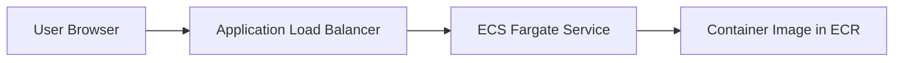

---

## Stage 2: Relational Data

### Goal

Replace in-memory or local file storage with managed relational persistence.

### AWS Focus

- `RDS PostgreSQL`
- `Secrets Manager`

### App Scope

- Notes stored in PostgreSQL
- Database migrations
- Connection string pulled from Secrets Manager

Minimal data model:

- `id`
- `title`
- `content`
- `created_at`
- `created_by`

### AI Prompt

```text
Upgrade "Team Notes Pro" to Stage 2.

Current app:
- small containerized notes app
- deployed on ECS Fargate behind an ALB

New requirements:
- Move note storage to Amazon RDS for PostgreSQL
- Store database credentials in AWS Secrets Manager
- Add a simple migration or schema bootstrap process
- Keep the data model small:
  - id
  - title
  - content
  - created_at
  - created_by
- Keep the code easy to read and intentionally small
- Explain security group basics for ECS-to-RDS access

Output:
1. Updated application code
2. Database schema or migration files
3. Environment variables and secrets list
4. Brief deployment steps for RDS and Secrets Manager
5. Mermaid architecture diagram
```

### Brief AWS Deploy Guide

1. Create a PostgreSQL RDS instance in private subnets.
2. Store credentials in Secrets Manager.
3. Allow ECS tasks to connect through security groups.
4. Run schema creation or migrations.
5. Redeploy the ECS service with database configuration.

### Architecture Diagram

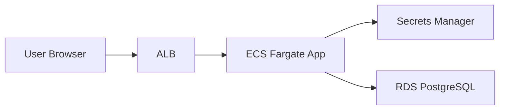

---

## Stage 3: Frontend Delivery and DNS

### Goal

Separate static frontend delivery from backend traffic and add a real domain setup.

### AWS Focus

- `S3`
- `CloudFront`
- `Route 53`
- `ACM`

### App Scope

- Static frontend served from S3 + CloudFront
- Backend API still runs on ECS behind ALB
- Custom domain

### AI Prompt

```text
Upgrade "Team Notes Pro" to Stage 3.

Current app:
- backend app on ECS Fargate behind an ALB
- PostgreSQL on RDS

New requirements:
- Separate the frontend into static assets hosted on S3
- Deliver the frontend with CloudFront
- Keep the backend API on ECS behind the ALB
- Add guidance for Route 53 and ACM for a custom domain
- Keep the frontend intentionally small
- Document how the frontend calls the backend API

Output:
1. Frontend source code
2. Backend updates if needed for API use
3. Deployment steps for S3, CloudFront, Route 53, and ACM
4. Mermaid architecture diagram
```

### Brief AWS Deploy Guide

1. Build the frontend assets.
2. Upload them to an S3 bucket.
3. Put CloudFront in front of S3.
4. Request an ACM certificate.
5. Create Route 53 records for frontend and API domains.
6. Point API DNS to the ALB.

### Architecture Diagram

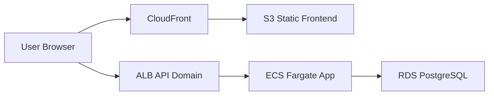

---

## Stage 4: User Identity

### Goal

Add proper sign-in so notes belong to users, not a shared anonymous app.

### AWS Focus

- `Cognito`

### App Scope

- Sign up
- Sign in
- Sign out
- Each user sees only their own notes

### AI Prompt

```text
Upgrade "Team Notes Pro" to Stage 4.

Current app:
- static frontend on S3 + CloudFront
- backend API on ECS
- PostgreSQL on RDS

New requirements:
- Add user authentication with Amazon Cognito
- Support sign up, sign in, and sign out
- Protect backend endpoints
- Store notes per user
- Keep the UI simple and avoid auth complexity beyond the basics
- Explain token validation at a high level

Output:
1. Updated frontend code
2. Updated backend code
3. Minimal database changes if required
4. Short Cognito setup guide
5. Mermaid architecture diagram
```

### Brief AWS Deploy Guide

1. Create a Cognito user pool and app client.
2. Configure frontend sign-in flow.
3. Validate Cognito tokens in the backend.
4. Associate note records with the authenticated user ID.

### Architecture Diagram

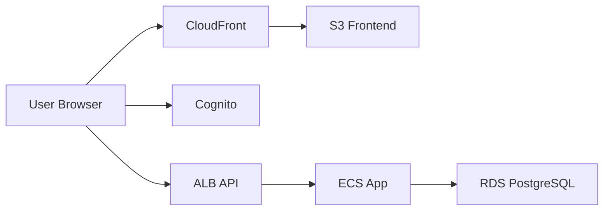

---

## Stage 5: Background Jobs

### Goal

Introduce asynchronous processing without turning the app into a large system.

### AWS Focus

- `SQS`
- `ECS Fargate worker service`

### App Scope

- User requests note export
- API creates a job
- Worker processes the export asynchronously
- Export status is visible in the UI

### AI Prompt

```text
Upgrade "Team Notes Pro" to Stage 5.

Current app:
- authenticated notes app on ECS with PostgreSQL

New requirements:
- Add asynchronous note export processing
- Use Amazon SQS for job queuing
- Add a separate ECS worker service that reads from the queue
- Keep the export feature intentionally small:
  - user requests export
  - job becomes queued / processing / completed / failed
  - completed export can be downloaded from S3 or shown as generated text
- Keep the architecture easy to understand

Output:
1. Updated API code
2. Worker service code
3. Queue message shape
4. Brief deployment steps
5. Mermaid architecture diagram
```

### Brief AWS Deploy Guide

1. Create an SQS queue.
2. Update the API service to publish export jobs.
3. Deploy a second ECS service as the worker.
4. Grant worker IAM permissions for SQS and output storage if used.

### Architecture Diagram

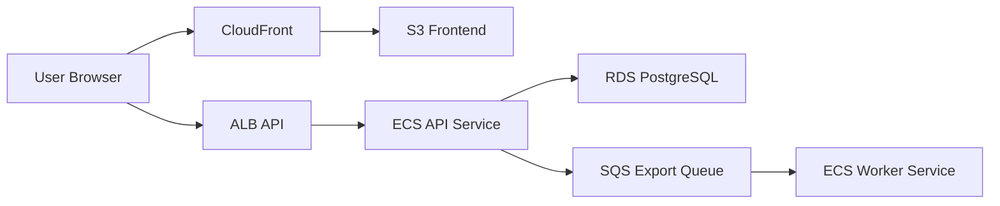

---

## Stage 6: Caching and Sessions

### Goal

Use caching to reduce repeated database work and introduce another common production service.

### AWS Focus

- `ElastiCache for Redis`

### App Scope

- Cache recent notes list
- Cache note summary counters
- Optional short-lived session or rate-limit data

### AI Prompt

```text
Upgrade "Team Notes Pro" to Stage 6.

Current app:
- frontend on CloudFront/S3
- API and worker on ECS
- PostgreSQL on RDS
- async jobs with SQS

New requirements:
- Add Redis through Amazon ElastiCache
- Cache the authenticated user's recent notes list
- Invalidate cache on note create/delete
- Optionally store lightweight short-lived session or throttling data
- Keep the caching logic very small and obvious
- Explain cache invalidation simply

Output:
1. Updated application code
2. Cache key design
3. Brief deployment steps
4. Mermaid architecture diagram
```

### Brief AWS Deploy Guide

1. Create a Redis cluster in private subnets.
2. Allow ECS tasks to connect with security groups.
3. Add cache reads on hot paths.
4. Invalidate or refresh cache when notes change.

### Architecture Diagram

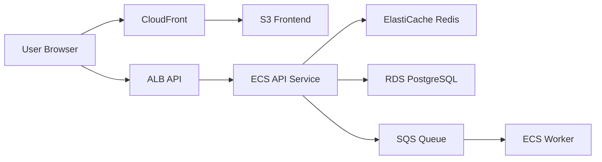

---

## Stage 7: Notifications and Fan-Out

### Goal

Add event-driven notifications when exports or other background tasks complete.

### AWS Focus

- `SNS`

### App Scope

- Notify users when export jobs finish
- Start with simple email or internal event fan-out

### AI Prompt

```text
Upgrade "Team Notes Pro" to Stage 7.

Current app:
- async export jobs already run through SQS and ECS workers

New requirements:
- Publish an event when an export job completes
- Use Amazon SNS for notification fan-out
- Keep the user-facing feature small:
  - export completed
  - user receives a simple notification
- The notification can be email-based or stored as an internal app event if that keeps the code smaller
- Explain the difference between queueing and pub/sub briefly

Output:
1. Updated worker or API code
2. Notification event shape
3. Brief SNS deployment steps
4. Mermaid architecture diagram
```

### Brief AWS Deploy Guide

1. Create an SNS topic.
2. Publish export completion events from the worker.
3. Subscribe an email endpoint or another consumer.
4. Add minimal UI support if notifications appear in-app.

### Architecture Diagram

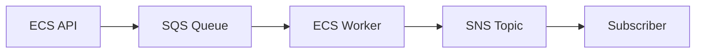

---

## Stage 8: Workflow Orchestration

### Goal

Use orchestration for multi-step jobs instead of packing all logic into one worker.

### AWS Focus

- `Step Functions`

### App Scope

- Export workflow becomes:
  - validate request
  - gather notes
  - generate output
  - store result
  - mark job complete

### AI Prompt

```text
Upgrade "Team Notes Pro" to Stage 8.

Current app:
- export jobs run through SQS and a worker service

New requirements:
- Replace or extend the export process with AWS Step Functions
- Keep the workflow intentionally small:
  - validate request
  - fetch notes
  - generate export payload
  - store export result
  - update job status
- Use ECS tasks or Lambda only where appropriate, but keep the number of moving parts low
- Explain why orchestration is useful here

Output:
1. Updated application/workflow code
2. State machine definition
3. Brief deployment steps
4. Mermaid architecture diagram
```

### Brief AWS Deploy Guide

1. Define the state machine.
2. Trigger it from the API or worker.
3. Let tasks update job status in PostgreSQL.
4. Store final output in S3 if downloading exports.

### Architecture Diagram

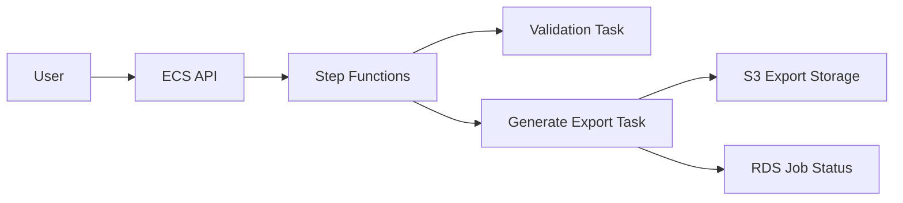

---

## Stage 9: Scheduled Automation

### Goal

Add recurring operations without inventing more product features than needed.

### AWS Focus

- `EventBridge`

### App Scope

- Nightly cleanup of expired exports
- Weekly team activity summary

### AI Prompt

```text
Upgrade "Team Notes Pro" to Stage 9.

Current app:
- notes platform with exports and workflow orchestration

New requirements:
- Add scheduled automation with Amazon EventBridge
- Include two small recurring jobs:
  - nightly cleanup of expired export files
  - weekly summary job
- The weekly summary can write a report row to the database or send a simple SNS notification
- Keep the automation logic intentionally small

Output:
1. Job code
2. EventBridge schedule definitions
3. Brief deployment steps
4. Mermaid architecture diagram
```

### Brief AWS Deploy Guide

1. Create EventBridge scheduled rules.
2. Route them to ECS tasks, Step Functions, or Lambda.
3. Confirm jobs are idempotent and safe to rerun.

### Architecture Diagram

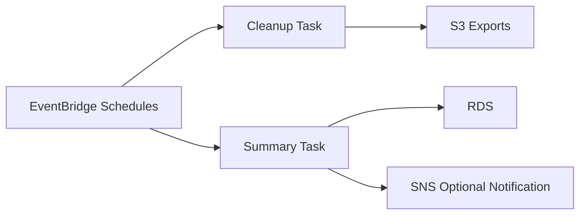

---

## Stage 10: Observability

### Goal

Add the operational signals needed to troubleshoot a real system.

### AWS Focus

- `CloudWatch`
- `X-Ray`
- `CloudWatch Alarms`

### App Scope

- Structured logs
- Custom metrics
- Request tracing
- Alarm on error rate or queue backlog

### AI Prompt

```text
Upgrade "Team Notes Pro" to Stage 10.

Current app:
- multi-service AWS notes platform

New requirements:
- Add structured application logging
- Publish a few custom CloudWatch metrics
- Add X-Ray tracing where practical
- Create alarms for:
  - API error rate
  - ECS task health
  - SQS queue depth
- Keep the implementation small and educational

Output:
1. Updated application code
2. Logging and metrics strategy
3. Alarm list
4. Brief deployment steps
5. Mermaid architecture diagram
```

### Brief AWS Deploy Guide

1. Send app logs to CloudWatch Logs.
2. Create dashboards or saved views.
3. Add X-Ray instrumentation to request paths.
4. Create alarms on the most important failure signals.

### Architecture Diagram

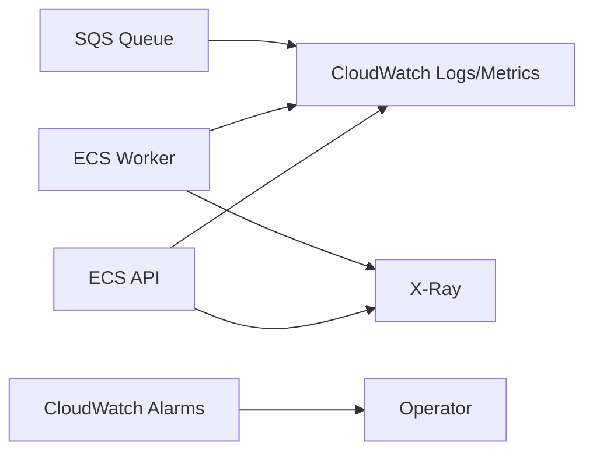

---

## Stage 11: Edge Protection

### Goal

Add a basic security layer at the edge.

### AWS Focus

- `WAF`

### App Scope

- Protect frontend or API entry points
- Simple rate-based rules
- Basic managed protections

### AI Prompt

```text
Upgrade "Team Notes Pro" to Stage 11.

Current app:
- frontend on CloudFront
- API behind an ALB

New requirements:
- Add AWS WAF
- Apply basic managed rules
- Add a simple rate-based rule for abusive traffic
- Explain whether WAF should attach to CloudFront, ALB, or both in this learning setup
- Keep the security guidance practical and minimal

Output:
1. Short architecture/security update
2. WAF rule recommendations
3. Brief deployment steps
4. Mermaid architecture diagram
```

### Brief AWS Deploy Guide

1. Create a WAF web ACL.
2. Add AWS managed rule groups.
3. Add a rate-based rule.
4. Associate the web ACL with CloudFront or ALB.

### Architecture Diagram

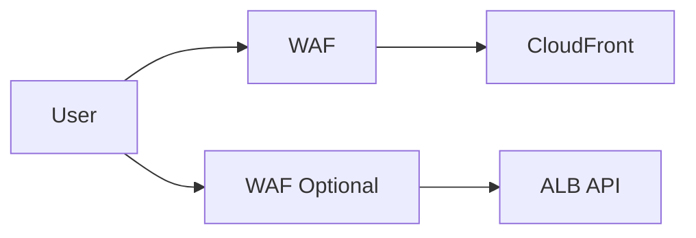

---

## Stage 12: CI/CD

### Goal

Automate image builds and deployments so the platform is repeatable.

### AWS Focus

- `CodePipeline`
- `CodeBuild`

### App Scope

- Build frontend assets
- Build container image
- Push image to ECR
- Deploy ECS service

### AI Prompt

```text
Upgrade "Team Notes Pro" to Stage 12.

Current app:
- full advanced AWS notes platform deployed manually

New requirements:
- Add CI/CD using AWS CodePipeline and CodeBuild
- Automate:
  - frontend build
  - backend container build
  - image push to ECR
  - ECS deployment
- Keep the pipeline straightforward and educational
- Mention where manual approval might make sense

Output:
1. Build spec examples
2. Pipeline stage design
3. Brief deployment steps
4. Mermaid architecture diagram
```

### Brief AWS Deploy Guide

1. Create a CodeBuild project.
2. Grant access to ECR, S3, and ECS deployment actions.
3. Create a CodePipeline pipeline.
4. Connect source, build, and deploy stages.

### Architecture Diagram

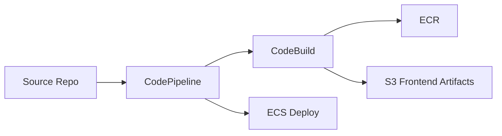

---

## Stage 13: Infrastructure as Code

### Goal

Stop treating the platform as click-ops and define it as code.

### AWS Focus

- `AWS CDK` or `Terraform`

### App Scope

- Model the platform infrastructure
- Make environments reproducible

### AI Prompt

```text
Upgrade "Team Notes Pro" to Stage 13.

Current app:
- full advanced notes platform running on AWS

New requirements:
- Define the infrastructure using either AWS CDK or Terraform
- Include:
  - VPC
  - ECS cluster and services
  - ALB
  - RDS
  - Redis
  - SQS
  - SNS
  - S3
  - CloudFront
  - WAF
  - monitoring basics
- Keep the project educational rather than enterprise-heavy
- Organize the infrastructure code so a learner can understand it

Output:
1. IaC project structure
2. Full infrastructure code
3. Variables or config file examples
4. Apply/deploy steps
5. Mermaid architecture diagram
```

### Brief AWS Deploy Guide

1. Pick `AWS CDK` if you want AWS-native abstractions in TypeScript or Python.
2. Pick `Terraform` if you want a widely portable IaC workflow.
3. Start with one environment and keep modules small.
4. Validate, plan, and deploy incrementally.

### Architecture Diagram

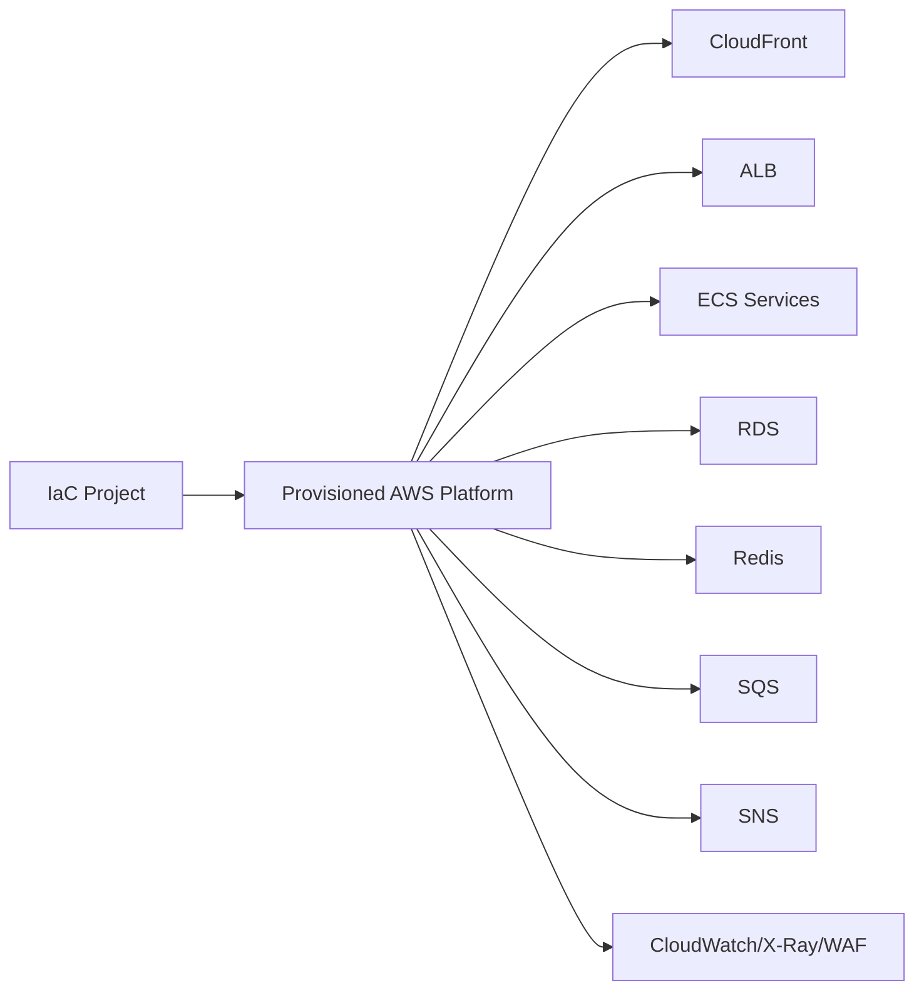

---

## Suggested Build Order

If you want the fastest learning path, use this order:

1. `Stage 1` through `Stage 4` to get a proper web app platform
2. `Stage 5` through `Stage 7` to learn async and event-driven patterns
3. `Stage 8` through `Stage 10` to learn orchestration and operations
4. `Stage 11` through `Stage 13` to learn security, delivery, and infrastructure automation

## Optional Extras After Stage 13

If you want to go beyond this roadmap, good next additions are:

- `Aurora PostgreSQL`
- `RDS Proxy`
- `AWS Backup`
- `OpenSearch`
- `KMS` customer-managed keys
- `Organizations` and multi-account layouts
- `EKS`
