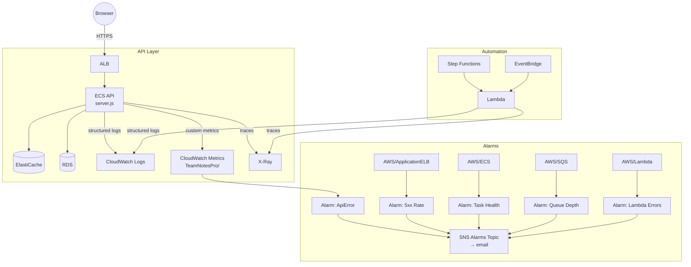

# Stage 10 Deployment: CloudWatch, X-Ray, Alarms

## What this stage does

Adds three observability layers:

| Layer | What | Where |
|-------|------|-------|
| **Structured logging** | JSON lines on stdout, queryable in Logs Insights | API (ECS) + Lambda |
| **Custom metrics** | CacheHit, CacheMiss, ExportStarted, ApiError in `TeamNotesPro` namespace | API (ECS) |
| **X-Ray tracing** | Per-request traces, segment per AWS SDK call | API (ECS) + Lambda |
| **Alarms** | 5 alarms covering API errors, ECS health, SQS depth, Lambda errors | CloudWatch |

---

## Logging strategy

Every `console.log` call in `server.js` and `lambda.js` now outputs a JSON line:

```json
{"level":"info","event":"http.request","ts":"2026-05-01T10:00:01.234Z","method":"GET","route":"/api/notes","status":200,"ms":12}
{"level":"error","event":"request.error","ts":"2026-05-01T10:00:02.000Z","method":"POST","route":"/api/exports","error":"StartExecution failed"}
```

ECS and Lambda both forward stdout to CloudWatch Logs automatically — no agent needed. In CloudWatch Logs Insights you can query across all instances of the API task:

```
# All errors in the last hour
fields @timestamp, event, route, error
| filter level = "error"
| sort @timestamp desc
| limit 20

# p95 response time per route
fields @timestamp, route, ms
| filter ispresent(ms)
| stats pct(ms, 95) as p95, avg(ms) as avg by route
| sort p95 desc
```

---

## Custom metrics strategy

Four metrics in the `TeamNotesPro` namespace:

| Metric | Emitted when | Useful for |
|--------|-------------|-----------|
| `CacheHit` | GET /api/notes served from Redis | Confirms Redis is working |
| `CacheMiss` | GET /api/notes hit the DB | Cache hit ratio = CacheHit / (CacheHit + CacheMiss) |
| `ExportStarted` | POST /api/exports called | Export usage trend |
| `ApiError` | Unhandled 500 in `wrap()` | App-level error rate, drives Alarm 5 |

Custom metrics are only published when `CLOUDWATCH_METRICS=true` is set. When unset (local dev), `putMetric()` returns immediately.

---

## X-Ray tracing

**API (ECS):** `aws-xray-sdk-core` middleware wraps every HTTP request in a segment and creates subsegments for each outgoing AWS SDK call (SFN, S3, Secrets Manager). Set `XRAY_ENABLED=true` in ECS env vars. Requires the X-Ray daemon as a sidecar container (see Step 4).

**Lambda:** Enable active tracing in the Lambda configuration (no code change needed). Lambda's execution environment includes the X-Ray daemon automatically.

A typical trace for `POST /api/exports` shows:
```
team-notes-pro-api (200ms)
  ├── PostgreSQL INSERT (8ms)
  └── SFN StartExecution (45ms)
```

---

## Architecture



---

## Step 1 — Build and push the updated API image

```bash
export AWS_ACCOUNT_ID=$(aws sts get-caller-identity --query Account --output text)
export AWS_REGION=us-east-1
ECR_URI=$AWS_ACCOUNT_ID.dkr.ecr.$AWS_REGION.amazonaws.com/team-notes-pro

aws ecr get-login-password --region $AWS_REGION \
  | docker login --username AWS --password-stdin \
    $AWS_ACCOUNT_ID.dkr.ecr.$AWS_REGION.amazonaws.com

cd team-notes-pro

docker build \
  --build-arg VITE_API_URL=https://api.notes.yourdomain.com \
  --build-arg VITE_COGNITO_USER_POOL_ID=us-east-1_XXXXXXXXX \
  --build-arg VITE_COGNITO_CLIENT_ID=XXXXXXXXXXXXXXXXXXXXXXXXXX \
  -t team-notes-pro:stage10 .

docker tag team-notes-pro:stage10 $ECR_URI:stage10
docker tag team-notes-pro:stage10 $ECR_URI:latest
docker push $ECR_URI:stage10
docker push $ECR_URI:latest
```

---

## Step 2 — Update the API ECS task definition

### Console

1. **ECS → Task definitions → team-notes-pro** → Create new revision
2. Container → **Environment variables** → add:

| Key | Value |
|-----|-------|
| `CLOUDWATCH_METRICS` | `true` |
| `XRAY_ENABLED` | `true` |

3. Create revision → update service → Force new deployment

---

## Step 3 — IAM: allow the API task role to publish CloudWatch metrics

The API's ECS task role needs `cloudwatch:PutMetricData`.

### Console

**IAM → Roles** → find the ECS API task role → **Add permissions → Create inline policy:**

```json
{
  "Version": "2012-10-17",
  "Statement": [{
    "Effect": "Allow",
    "Action": "cloudwatch:PutMetricData",
    "Resource": "*",
    "Condition": {
      "StringEquals": { "cloudwatch:namespace": "TeamNotesPro" }
    }
  }]
}
```

The `Condition` restricts the role to only writing to the `TeamNotesPro` namespace.

### CLI

```bash
ECS_TASK_ROLE=team-notes-pro-task-role   # replace with your actual role name

aws iam put-role-policy \
  --role-name "$ECS_TASK_ROLE" \
  --policy-name team-notes-pro-cloudwatch-metrics \
  --policy-document '{
    "Version": "2012-10-17",
    "Statement": [{
      "Effect": "Allow",
      "Action": "cloudwatch:PutMetricData",
      "Resource": "*",
      "Condition": {
        "StringEquals": { "cloudwatch:namespace": "TeamNotesPro" }
      }
    }]
  }'
```

---

## Step 4 — Add X-Ray daemon sidecar to the ECS task definition

The `aws-xray-sdk-core` SDK sends trace data to the daemon via UDP on `127.0.0.1:2000`. The daemon collects and batches traces to the X-Ray service.

### Console

1. In the same ECS task definition revision → **Add container**:
   - Name: `xray-daemon`
   - Image: `public.ecr.aws/xray/aws-xray-daemon:latest`
   - CPU: `32`
   - Memory soft limit: `256`
   - Port mappings: `2000 / udp`
   - No environment variables needed

2. The task role also needs `xray:PutTraceSegments` and `xray:PutTelemetryRecords`:

```json
{
  "Effect": "Allow",
  "Action": ["xray:PutTraceSegments", "xray:PutTelemetryRecords"],
  "Resource": "*"
}
```

> The X-Ray daemon container shares the task network namespace, so `127.0.0.1:2000` reaches it from the app container.

---

## Step 5 — Enable X-Ray active tracing on the Lambda

### Console

1. **Lambda → team-notes-pro-export → Configuration → Monitoring and operations tools**
2. **X-Ray → Active tracing → Edit → Enable**
3. Save

### CLI

```bash
aws lambda update-function-configuration \
  --function-name team-notes-pro-export \
  --tracing-config Mode=Active
```

Lambda's execution environment runs the X-Ray daemon automatically — no sidecar needed.

---

## Step 6 — Redeploy Lambda with the updated code

```bash
cd team-notes-pro/backend

rm -rf /tmp/lambda-pkg && mkdir /tmp/lambda-pkg
cp lambda.js logger.js db.js package.json /tmp/lambda-pkg/
cd /tmp/lambda-pkg && npm install --omit=dev
zip -r /tmp/lambda.zip .

aws lambda update-function-code \
  --function-name team-notes-pro-export \
  --zip-file fileb:///tmp/lambda.zip
```

---

## Step 7 — Create CloudWatch alarms

```bash
cd team-notes-pro

# Optional: set ALARM_EMAIL to receive notifications
ALARM_EMAIL=ops@yourdomain.com ./infra/stage10/alarms.sh
```

The script creates 5 alarms and prints a console link when done. If you set `ALARM_EMAIL`, it creates a dedicated `team-notes-pro-alarms` SNS topic and emails a subscription confirmation.

**Alarm summary:**

| Alarm | Trigger condition | Namespace |
|-------|------------------|-----------|
| `TeamNotesPro-API-5xx` | > 5 ALB 5xx responses in 5 min | AWS/ApplicationELB |
| `TeamNotesPro-ECS-TaskHealth` | Running task count < 1 for 1 min | AWS/ECS |
| `TeamNotesPro-SQS-Depth` | Queue depth > 10 for 10 min | AWS/SQS |
| `TeamNotesPro-Lambda-Errors` | > 3 Lambda errors in 5 min | AWS/Lambda |
| `TeamNotesPro-CustomApiError` | > 3 `ApiError` custom metric in 5 min | TeamNotesPro |

---

## Verifying structured logs in Logs Insights

After deploying, open **CloudWatch → Logs Insights**, select the log group `/ecs/team-notes-pro`, and run:

```
fields @timestamp, level, event, route, status, ms
| filter ispresent(route)
| sort @timestamp desc
| limit 50
```

You should see one JSON line per HTTP request. For errors:

```
fields @timestamp, event, route, error
| filter level = "error"
| sort @timestamp desc
```

---

## Verifying custom metrics

**CloudWatch → Metrics → Custom namespaces → TeamNotesPro**

After a few API calls, you'll see `CacheHit`, `CacheMiss`, and `ExportStarted` data points. To see the cache hit ratio as a percentage, create a metric math expression in a graph:

```
CacheHit / (CacheHit + CacheMiss) * 100
```

---

## Cost estimate

| Service | Cost |
|---------|------|
| CloudWatch Logs ingestion | ~$0.50/GB — JSON lines are small, typically cents/month |
| CloudWatch Logs Insights queries | $0.005 per GB scanned |
| CloudWatch custom metrics | $0.30 per metric/month (5 metrics = $1.50/month) |
| CloudWatch alarms | $0.10 per alarm/month (5 alarms = $0.50/month) |
| X-Ray traces | Free tier: 100,000 traces/month |

Total: ~$2–3/month at learning-lab scale.

---

## What's next — Stage 11

Stage 11 adds **WAF** (Web Application Firewall) in front of CloudFront and the ALB: rate-based rules to block credential stuffing, and AWS-managed rule sets for common web exploits (SQL injection, XSS, known bad IPs).
