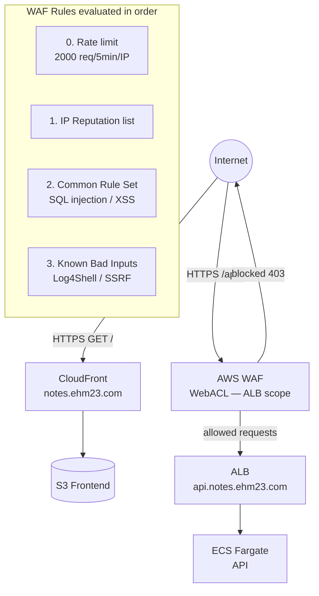

# Stage 11 Deployment: AWS WAF

## What this stage does

Adds a Web Application Firewall in front of the API to block abusive traffic and known attack patterns before they reach ECS.

No application code changes. WAF is pure AWS configuration.

**New AWS service: AWS WAF v2**

WAF inspects each HTTP request before it reaches your backend. Rules are evaluated in priority order; the first matching rule's action (Allow / Block / Count) wins. Unmatched requests fall through to the default action (Allow).

---

## Where to attach WAF: CloudFront, ALB, or both?

| | CloudFront WAF | ALB WAF |
|--|----------------|---------|
| Scope | Must be in `us-east-1` (global) | Regional, same region as ALB |
| Protects | Static frontend delivery | API endpoints |
| Most useful for | Blocking bots that scrape `notes.ehm23.com` | Blocking attacks on `/api/*` |
| This app | Optional | **Required** |

**Decision for this learning setup: attach WAF to the ALB only.**

The frontend is static files served from S3 — there is nothing to inject into or exploit there. The ALB is where authentication, note data, and export logic live. That is where WAF provides real value.

If you later want to block bots from hitting CloudFront, add a second WebACL scoped to `CLOUDFRONT` and attach it to the distribution in `us-east-1`. The rules would be identical.

---

## WAF rules

Four rules in priority order:

| Priority | Rule | Action | Why |
|----------|------|--------|-----|
| 0 | Rate limit (2000 req / 5 min / IP) | Block | Stops credential stuffing, export abuse, scraping |
| 1 | AWS IP Reputation List | Block (managed) | Known bots, malicious scanners, scrapers |
| 2 | Common Rule Set (OWASP Top 10) | Block (managed) | SQL injection, XSS, path traversal |
| 3 | Known Bad Inputs | Block (managed) | Log4Shell, SSRF, known CVE payloads |

**Rate limit tuning:** 2000 requests per 5 minutes = ~6.7 requests/second sustained. A real user polling the export status every 2 seconds generates 150 requests over 5 minutes — well within the limit. Automated attacks typically send thousands per minute.

**`SizeRestrictions_BODY` override:** The Common Rule Set blocks request bodies over 8 KB by default. A long note with rich content can exceed this, so this specific rule is set to `Count` (log but allow). Watch the CloudWatch `CountedRequests` metric for this rule; if no legitimate requests are being counted after a week, you can switch it back to `Block`.

---

## Architecture



---

## Step 1 — Create the WebACL

### Console (recommended)

1. Open **WAF & Shield → Web ACLs → Create web ACL**
2. **Resource type:** Regional resources
3. **Region:** us-east-1 (same as your ALB)
4. **Name:** `team-notes-pro-waf`
5. Click **Next**

**Add rules:**

6. **Add rules → Add managed rule groups**
   - Check ✅ **Amazon IP reputation list**
   - Check ✅ **Core rule set** — then click **Edit** → find `SizeRestrictions_BODY` → change action to **Count**
   - Check ✅ **Known bad inputs**
   - Click **Add rules**

7. **Add rules → Add my own rules → Rule builder**
   - Name: `RateLimit`
   - Type: **Rate-based rule**
   - Rate limit: `2000`
   - Evaluation window: **5 minutes**
   - Aggregate based on: **Source IP**
   - Action: **Block**
   - Click **Add rule**

8. **Set rule priority** — drag to this order:
   - `RateLimit` (top)
   - `AWSManagedRulesAmazonIpReputationList`
   - `AWSManagedRulesCommonRuleSet`
   - `AWSManagedRulesKnownBadInputsRuleSet`

9. **Default action:** Allow
10. Click through to **Create web ACL**

### CLI alternative

```bash
REGION=us-east-1

# Strip the _comment fields (not valid JSON for AWS CLI) and create
WEB_ACL_ARN=$(python3 -c "
import json, sys
data = json.load(open('team-notes-pro/infra/stage11/webacl.json'))
# Remove _comment keys recursively
def strip(obj):
    if isinstance(obj, dict):
        return {k: strip(v) for k, v in obj.items() if not k.startswith('_')}
    if isinstance(obj, list):
        return [strip(i) for i in obj]
    return obj
print(json.dumps(strip(data)))
" | aws wafv2 create-web-acl \
  --region "$REGION" \
  --cli-input-json /dev/stdin \
  --query 'Summary.ARN' --output text)

echo "WebACL ARN: $WEB_ACL_ARN"
```

---

## Step 2 — Associate the WebACL with the ALB

### Console

1. On the WebACL detail page → **Associated AWS resources** → **Add AWS resources**
2. Resource type: **Application Load Balancer**
3. Select `team-notes-pro-alb`
4. Click **Add**

### CLI

```bash
ALB_ARN="arn:aws:elasticloadbalancing:us-east-1:853696859325:loadbalancer/app/team-notes-pro-alb/6d6150021197081c"

aws wafv2 associate-web-acl \
  --region us-east-1 \
  --web-acl-arn "$WEB_ACL_ARN" \
  --resource-arn "$ALB_ARN"
```

---

## Step 3 — Enable WAF logging (optional but recommended)

WAF can log every sampled request to CloudWatch Logs or S3. This is useful for:
- Seeing what requests are being blocked
- Tuning rules that are causing false positives

### Console

1. WebACL → **Logging and metrics** → **Enable logging**
2. **Logging destination:** CloudWatch Logs log group
3. Create log group: `aws-waf-logs-team-notes-pro`
   > WAF requires the log group name to start with `aws-waf-logs-` exactly — no leading slash.
4. Click **Save**

### CLI

```bash
aws logs create-log-group \
  --log-group-name aws-waf-logs-team-notes-pro \
  --region us-east-1

LOG_GROUP_ARN="arn:aws:logs:us-east-1:853696859325:log-group:aws-waf-logs-team-notes-pro"

aws wafv2 put-logging-configuration \
  --region us-east-1 \
  --logging-configuration "ResourceArn=${WEB_ACL_ARN},LogDestinationConfigs=${LOG_GROUP_ARN}"
```

---

## Testing

**Verify WAF is active:**
```bash
# Normal request — should return 200
curl -s -o /dev/null -w "%{http_code}" \
  https://api.notes.ehm23.com/health
```

**Trigger the rate limit** (sends 2001 requests rapidly, last ones should get 403):
```bash
for i in $(seq 1 50); do
  curl -s -o /dev/null -w "%{http_code} " \
    https://api.notes.ehm23.com/health
done
```

**Trigger the SQL injection rule** (should get 403):
```bash
curl -s -o /dev/null -w "%{http_code}" \
  "https://api.notes.ehm23.com/api/notes?id=1%20OR%201%3D1"
```

**View blocked requests** in the WAF console:
**WAF → Web ACLs → team-notes-pro-waf → Traffic overview**

---

## Monitoring WAF in CloudWatch

WAF publishes metrics automatically to `AWS/WAFV2`:

| Metric | Meaning |
|--------|---------|
| `AllowedRequests` | Requests that passed all rules |
| `BlockedRequests` | Requests blocked by any rule |
| `CountedRequests` | Requests matched a Count rule (watch this for false positives) |

View per-rule metrics by filtering the `Rule` dimension. For example, to see how many requests hit the rate limit rule specifically, look for `MetricName=RateLimit`.

Add a CloudWatch alarm on `BlockedRequests` spiking to detect active attacks:

```bash
aws cloudwatch put-metric-alarm \
  --alarm-name "TeamNotesPro-WAF-BlockSpike" \
  --alarm-description "WAF blocking unusually high volume of requests" \
  --namespace AWS/WAFV2 \
  --metric-name BlockedRequests \
  --dimensions \
      "Name=WebACL,Value=team-notes-pro-waf" \
      "Name=Region,Value=us-east-1" \
      "Name=Rule,Value=ALL" \
  --period 300 \
  --evaluation-periods 1 \
  --threshold 100 \
  --comparison-operator GreaterThanThreshold \
  --statistic Sum \
  --treat-missing-data notBreaching
```

---

## Cost estimate

| Resource | Cost |
|----------|------|
| WebACL | $5.00/month |
| Each rule (4 rules) | $1.00/month each = $4.00/month |
| Per 1M requests | $0.60 |
| **Total at low traffic** | **~$9.60/month** |

WAF is the most expensive service added in this lab so far. Delete or disable the WebACL when not actively learning to save cost.

```bash
# Disassociate to stop inspection (stops billing for request processing)
aws wafv2 disassociate-web-acl \
  --region us-east-1 \
  --resource-arn "$ALB_ARN"

# Or delete the WebACL entirely (need to get the lock token first)
LOCK=$(aws wafv2 get-web-acl --region us-east-1 \
  --name team-notes-pro-waf --scope REGIONAL \
  --query 'LockToken' --output text)
aws wafv2 delete-web-acl --region us-east-1 \
  --name team-notes-pro-waf --scope REGIONAL \
  --id "$WEB_ACL_ID" --lock-token "$LOCK"
```

---

## What's next — Stage 12

Stage 12 adds **CodePipeline + CodeBuild** for automated CI/CD: a pipeline that triggers on a git push, builds the Docker image, pushes to ECR, and deploys to ECS — replacing the manual `docker build` + `aws ecs update-service` steps done throughout this lab.
