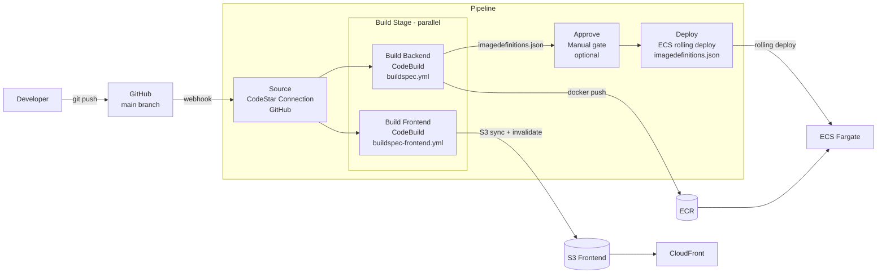

# Stage 12 Deployment: CodePipeline + CodeBuild

## What this stage does

Replaces the manual `docker build → docker push → aws ecs update-service` workflow with an automated pipeline that triggers on every git push.

**New AWS services:**

| Service | Role |
|---------|------|
| CodePipeline | Orchestrates the stages: source → build → deploy |
| CodeBuild | Runs the actual build commands (Docker, npm, AWS CLI) |
| CodeStar Connections | Securely connects CodePipeline to GitHub |
| S3 (artifact bucket) | Temporary storage for build artifacts between pipeline stages |

---

## Pipeline design



**Two parallel build actions** — backend and frontend build independently; neither waits for the other. The ECS deploy happens only after the backend build produces `imagedefinitions.json`.

---

## What `imagedefinitions.json` is

CodePipeline's ECS deploy action reads this file to know which image to deploy:

```json
[{"name":"app","imageUri":"853696859325.dkr.ecr.us-east-1.amazonaws.com/team-notes-pro:abc12345"}]
```

- `name` must exactly match the container name in the ECS task definition (`app`)
- `imageUri` uses the short commit hash as a tag, not `:latest` — this makes every deploy traceable in ECR

CodePipeline creates a new task definition revision with this image URI, then updates the ECS service. If the new tasks fail health checks, ECS rolls back automatically.

---

## Where manual approval makes sense

The pipeline runs on every push. You might want a manual gate:

- **Before ECS deploy:** After the build succeeds but before the new image reaches production. Useful if you want a human to review test output or a diff before it goes live.
- **Not necessary here for:** the frontend S3 deploy — a broken frontend is easy to roll back (just re-deploy the previous commit); CloudFront serves the old files until invalidation completes.

To add the Approve stage: in CodePipeline, add a stage between Build and Deploy, add an action of type "Manual approval", and configure an SNS topic for the notification email.

---

## Step 1 — Create SSM Parameter Store parameters

These hold build-time configuration that both buildspecs read. Storing them in SSM means you update one place when a value changes — no pipeline edits needed.

```bash
aws ssm put-parameter --name "/team-notes-pro/vite-api-url" \
  --value "https://api.notes.ehm23.com" --type String --overwrite

aws ssm put-parameter --name "/team-notes-pro/cognito-user-pool-id" \
  --value "us-east-1_hXPK9kZRa" --type String --overwrite

aws ssm put-parameter --name "/team-notes-pro/cognito-client-id" \
  --value "4309f2d68f7hvnlm0dngndcen8" --type String --overwrite
```

---

## Step 2 — Create the CodeBuild service role

Both CodeBuild projects share one IAM role.

### Console

1. **IAM → Roles → Create role**
2. Trusted entity: **AWS service → CodeBuild**
3. Name: `codebuild-team-notes-pro-role`
4. Attach these managed policies:
   - `AmazonEC2ContainerRegistryPowerUser` — docker push to ECR
   - `AmazonS3FullAccess` — sync frontend to S3 *(tighten to specific bucket in production)*
5. Add an inline policy for the remaining permissions:

```json
{
  "Version": "2012-10-17",
  "Statement": [
    {
      "Effect": "Allow",
      "Action": [
        "ssm:GetParameters",
        "ssm:GetParameter"
      ],
      "Resource": "arn:aws:ssm:us-east-1:853696859325:parameter/team-notes-pro/*"
    },
    {
      "Effect": "Allow",
      "Action": "cloudfront:CreateInvalidation",
      "Resource": "arn:aws:cloudfront::853696859325:distribution/E3HOSF1U0C2PIG"
    },
    {
      "Effect": "Allow",
      "Action": [
        "logs:CreateLogGroup",
        "logs:CreateLogStream",
        "logs:PutLogEvents"
      ],
      "Resource": "*"
    }
  ]
}
```

---

## Step 3 — Create the two CodeBuild projects

> **Important:** Do not create CodeBuild projects standalone in the CodeBuild console first. The "AWS CodePipeline" source option only appears when you create a project from within the CodePipeline wizard. Create the projects in Step 5 instead — the pipeline wizard has a **"Create project"** button in the Build stage that opens an embedded CodeBuild form with source pre-set to CodePipeline automatically.

If you already created projects standalone with the wrong source, delete them and recreate from inside the pipeline wizard.

---

## Step 4 — Connect to GitHub

### Console

1. **CodePipeline → Settings → Connections → Create connection**
2. Provider: **GitHub**
3. Connection name: `team-notes-pro-github`
4. Click **Connect to GitHub** → authorize the AWS Connector app
5. Click **Connect** — status changes to **Available**
6. Copy the connection ARN

---

## Step 5 — Create the pipeline

### Console

1. **CodePipeline → Create pipeline**

2. **Pipeline settings:**
   - Name: `team-notes-pro`
   - New service role (let AWS create it)
   - Artifact store: **Default location** (CodePipeline creates an S3 bucket)

3. **Source stage:**
   - Source provider: **GitHub (Version 2)**
   - Connection: `team-notes-pro-github`
   - Repository: `your-username/aws-practice-lab-advanced`
   - Branch: `main`
   - Output artifact format: **CodePipeline default**

4. **Build stage:**
   - Click **Add action group** (this creates a parallel group)

   **Action 1 — BuildBackend:**
   - Action name: `BuildBackend`
   - Action provider: **CodeBuild**
   - Input artifacts: `SourceArtifact`
   - Click **Create project** — a panel opens with source already set to **AWS CodePipeline**:
     - Project name: `team-notes-pro-backend`
     - Environment image: **Managed image**
     - Operating system: **Amazon Linux**
     - Runtime: **Standard**
     - Image: **aws/codebuild/amazonlinux-x86_64-standard:5.0**
     - Privileged: ✅ **Enable this flag** (required for `docker build`)
     - Service role: select `codebuild-team-notes-pro-role`
     - Buildspec: **Use a buildspec file** → Buildspec name: `team-notes-pro/buildspec.yml`
     - Click **Continue to CodePipeline**
   - Output artifacts: `BackendBuildArtifact`

   **Action 2 — BuildFrontend (click "Add action" in the same action group → runs in parallel):**
   - Action name: `BuildFrontend`
   - Action provider: **CodeBuild**
   - Input artifacts: `SourceArtifact`
   - Click **Create project**:
     - Project name: `team-notes-pro-frontend`
     - Environment image: **Managed image** (same as above)
     - Privileged: not required (no Docker)
     - Service role: `codebuild-team-notes-pro-role`
     - Buildspec: **Use a buildspec file** → `team-notes-pro/buildspec-frontend.yml`
     - Click **Continue to CodePipeline**
   - Output artifacts: *(leave blank — deploys directly to S3)*

5. **[Optional] Approve stage:**
   - Add stage → name it `Approve`
   - Add action → type: **Manual approval**
   - SNS topic ARN: use `team-notes-pro-alarms` or create a new one
   - Comments: "Review build logs before deploying to ECS"

6. **Deploy stage:**
   - Action provider: **Amazon ECS**
   - Input artifacts: `BackendBuildArtifact`
   - Cluster name: `team-notes-pro`
   - Service name: `team-notes-pro-svc`
   - Image definitions file: `imagedefinitions.json`

7. Click **Create pipeline** — it will trigger immediately with the current `main` branch

---

## Step 6 — Grant CodePipeline permission to pass the CodeBuild role

CodePipeline's auto-created service role needs `iam:PassRole` to use the CodeBuild role:

```bash
PIPELINE_ROLE=$(aws codepipeline get-pipeline \
  --name team-notes-pro \
  --query 'pipeline.roleArn' --output text | sed 's|.*/||')

aws iam put-role-policy \
  --role-name "$PIPELINE_ROLE" \
  --policy-name pass-codebuild-role \
  --policy-document '{
    "Version": "2012-10-17",
    "Statement": [{
      "Effect": "Allow",
      "Action": "iam:PassRole",
      "Resource": "arn:aws:iam::853696859325:role/codebuild-team-notes-pro-role"
    }]
  }'
```

---

## How a deploy works end-to-end

```
git push origin main
  │
  ├─ CodePipeline detects push (webhook from CodeStar Connection)
  │
  ├─ Source: downloads zip of repo → S3 artifact bucket
  │
  ├─ Build [parallel]:
  │   ├─ BuildBackend (3–5 min):
  │   │   docker build → ECR push → writes imagedefinitions.json
  │   └─ BuildFrontend (1–2 min):
  │       npm ci → npm run build → S3 sync → CF invalidation
  │
  ├─ [Approve: human reviews, clicks Approve in console]
  │
  └─ Deploy (1–3 min):
      CodePipeline reads imagedefinitions.json
      → registers new ECS task definition revision
      → starts rolling deploy (new tasks, drain old tasks)
      → waits for service to stabilize
```

Total time: ~7–10 minutes from push to live (5 min if skipping manual approval).

---

## Verifying a pipeline run

```bash
# Watch the latest execution
aws codepipeline list-pipeline-executions \
  --pipeline-name team-notes-pro \
  --query 'pipelineExecutionSummaries[:3].{id:pipelineExecutionId,status:status,trigger:trigger.triggerType}' \
  --output table

# Get detailed status of each stage
aws codepipeline get-pipeline-state \
  --name team-notes-pro \
  --query 'stageStates[*].{stage:stageName,status:latestExecution.status}' \
  --output table
```

If a build fails, go to **CodeBuild → Build history → click the failed build → Build logs** — it streams in real time.

---

## Cost estimate

| Resource | Cost |
|----------|------|
| CodePipeline | $1.00/month per active pipeline |
| CodeBuild | Free tier: 100 build-minutes/month. After: $0.005/min for small instance |
| S3 artifact bucket | ~$0.01/month |
| CodeStar Connection | Free |

A typical push uses ~8 minutes of CodeBuild time. At $0.005/min that's $0.04/push after the free tier.

---

## What's next — Stage 13

Stage 13 converts the entire infrastructure — VPC, ECS, RDS, ElastiCache, S3, CloudFront, WAF, EventBridge, Step Functions — into code using **AWS CDK** or **Terraform**, replacing the manual console and CLI steps done throughout this lab.
