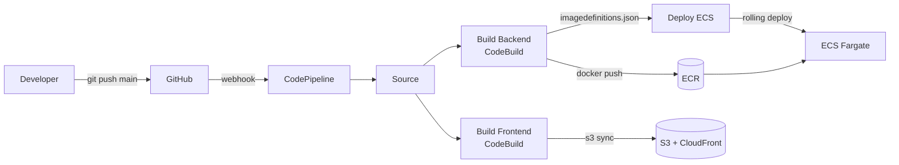

# Stage 12 Deployment: CodePipeline + CodeBuild

## What this stage does

Every `git push origin main` automatically:
1. Builds the Docker image and pushes it to ECR
2. Deploys the frontend to S3 + CloudFront
3. Rolls out the new image to ECS

Two buildspec files live in the repo:
- `team-notes-pro/buildspec.yml` — Docker build, ECR push, writes `imagedefinitions.json`
- `team-notes-pro/buildspec-frontend.yml` — npm build, S3 sync, CloudFront invalidation

---

## Architecture



---

## Prerequisites

- GitHub connection already created (`team-notes-pro-github`)
- SSM parameters already set (verify with `aws ssm get-parameters-by-path --path /team-notes-pro --query 'Parameters[*].Name' --output text`)

If SSM parameters are missing, create them:
```bash
aws ssm put-parameter --name "/team-notes-pro/vite-api-url" \
  --value "https://api.notes.yourdomain.com" --type String --overwrite

aws ssm put-parameter --name "/team-notes-pro/cognito-user-pool-id" \
  --value "us-east-1_XXXXXXXXX" --type String --overwrite

aws ssm put-parameter --name "/team-notes-pro/cognito-client-id" \
  --value "XXXXXXXXXXXXXXXXXXXXXXXXXX" --type String --overwrite
```

---

## Step 1 — Create the CodeBuild IAM role

```bash
ACCOUNT_ID=$(aws sts get-caller-identity --query Account --output text)
REGION=us-east-1

aws iam create-role \
  --role-name codebuild-team-notes-pro-role \
  --assume-role-policy-document '{
    "Version":"2012-10-17",
    "Statement":[{
      "Effect":"Allow",
      "Principal":{"Service":"codebuild.amazonaws.com"},
      "Action":"sts:AssumeRole"
    }]
  }' \
  --query 'Role.RoleName' --output text

aws iam attach-role-policy \
  --role-name codebuild-team-notes-pro-role \
  --policy-arn arn:aws:iam::aws:policy/AmazonEC2ContainerRegistryPowerUser

aws iam attach-role-policy \
  --role-name codebuild-team-notes-pro-role \
  --policy-arn arn:aws:iam::aws:policy/CloudWatchLogsFullAccess

aws iam put-role-policy \
  --role-name codebuild-team-notes-pro-role \
  --policy-name team-notes-pro-codebuild \
  --policy-document "{
    \"Version\": \"2012-10-17\",
    \"Statement\": [
      {
        \"Effect\": \"Allow\",
        \"Action\": [\"ssm:GetParameter\",\"ssm:GetParameters\"],
        \"Resource\": \"arn:aws:ssm:${REGION}:${ACCOUNT_ID}:parameter/team-notes-pro/*\"
      },
      {
        \"Effect\": \"Allow\",
        \"Action\": [\"s3:GetObject\",\"s3:GetObjectVersion\",\"s3:PutObject\",\"s3:GetBucketAcl\",\"s3:GetBucketLocation\"],
        \"Resource\": [
          \"arn:aws:s3:::codepipeline-team-notes-pro-${ACCOUNT_ID}\",
          \"arn:aws:s3:::codepipeline-team-notes-pro-${ACCOUNT_ID}/*\"
        ]
      },
      {
        \"Effect\": \"Allow\",
        \"Action\": [\"s3:PutObject\",\"s3:DeleteObject\",\"s3:ListBucket\",\"s3:GetObject\"],
        \"Resource\": [
          \"arn:aws:s3:::team-notes-pro-frontend-${ACCOUNT_ID}\",
          \"arn:aws:s3:::team-notes-pro-frontend-${ACCOUNT_ID}/*\"
        ]
      },
      {
        \"Effect\": \"Allow\",
        \"Action\": \"cloudfront:CreateInvalidation\",
        \"Resource\": \"arn:aws:cloudfront::${ACCOUNT_ID}:distribution/*\"
      }
    ]
  }"
```

---

## Step 2 — Create the CodeBuild projects

> **Important:** Create projects via CLI with `type=CODEPIPELINE` as the source type. The console does not show "AWS CodePipeline" as a source option unless you create the project from inside the pipeline wizard — using the CLI avoids that confusion entirely.

```bash
ROLE_ARN="arn:aws:iam::${ACCOUNT_ID}:role/codebuild-team-notes-pro-role"

# Backend — needs Docker (privilegedMode=true)
aws codebuild create-project \
  --name team-notes-pro-backend \
  --source "type=CODEPIPELINE,buildspec=team-notes-pro/buildspec.yml" \
  --artifacts "type=CODEPIPELINE" \
  --environment "type=LINUX_CONTAINER,computeType=BUILD_GENERAL1_SMALL,image=aws/codebuild/standard:7.0,privilegedMode=true" \
  --service-role "$ROLE_ARN" \
  --query 'project.name' --output text

# Frontend — no Docker needed
aws codebuild create-project \
  --name team-notes-pro-frontend \
  --source "type=CODEPIPELINE,buildspec=team-notes-pro/buildspec-frontend.yml" \
  --artifacts "type=CODEPIPELINE" \
  --environment "type=LINUX_CONTAINER,computeType=BUILD_GENERAL1_SMALL,image=aws/codebuild/standard:7.0,privilegedMode=false" \
  --service-role "$ROLE_ARN" \
  --query 'project.name' --output text
```

---

## Step 3 — Create the pipeline artifact bucket

```bash
ARTIFACT_BUCKET="codepipeline-team-notes-pro-${ACCOUNT_ID}"

aws s3api create-bucket \
  --bucket "$ARTIFACT_BUCKET" \
  --region "$REGION"
```

---

## Step 4 — Create the CodePipeline service role

```bash
aws iam create-role \
  --role-name codepipeline-team-notes-pro-role \
  --assume-role-policy-document '{
    "Version":"2012-10-17",
    "Statement":[{
      "Effect":"Allow",
      "Principal":{"Service":"codepipeline.amazonaws.com"},
      "Action":"sts:AssumeRole"
    }]
  }' \
  --query 'Role.RoleName' --output text

aws iam attach-role-policy \
  --role-name codepipeline-team-notes-pro-role \
  --policy-arn arn:aws:iam::aws:policy/AWSCodePipeline_FullAccess

CONNECTION_ARN=$(aws codestar-connections list-connections \
  --query 'Connections[?ConnectionName==`team-notes-pro-github`].ConnectionArn' \
  --output text)

aws iam put-role-policy \
  --role-name codepipeline-team-notes-pro-role \
  --policy-name codepipeline-team-notes-pro-inline \
  --policy-document "{
    \"Version\":\"2012-10-17\",
    \"Statement\":[
      {
        \"Effect\":\"Allow\",
        \"Action\":[\"codebuild:BatchGetBuilds\",\"codebuild:StartBuild\",\"codebuild:StopBuild\"],
        \"Resource\":\"*\"
      },
      {
        \"Effect\":\"Allow\",
        \"Action\":[\"s3:GetObject\",\"s3:PutObject\",\"s3:GetBucketVersioning\"],
        \"Resource\":[
          \"arn:aws:s3:::${ARTIFACT_BUCKET}\",
          \"arn:aws:s3:::${ARTIFACT_BUCKET}/*\"
        ]
      },
      {
        \"Effect\":\"Allow\",
        \"Action\":\"codestar-connections:UseConnection\",
        \"Resource\":\"${CONNECTION_ARN}\"
      },
      {
        \"Effect\":\"Allow\",
        \"Action\":[
          \"ecs:DescribeServices\",\"ecs:DescribeTaskDefinition\",
          \"ecs:RegisterTaskDefinition\",\"ecs:UpdateService\"
        ],
        \"Resource\":\"*\"
      },
      {
        \"Effect\":\"Allow\",
        \"Action\":\"iam:PassRole\",
        \"Resource\":\"*\"
      }
    ]
  }"
```

---

## Step 5 — Create the pipeline

Replace `YOUR_GITHUB_USERNAME` with your GitHub username, then run:

```bash
PIPELINE_ROLE="arn:aws:iam::${ACCOUNT_ID}:role/codepipeline-team-notes-pro-role"
CONNECTION_ARN=$(aws codestar-connections list-connections \
  --query 'Connections[?ConnectionName==`team-notes-pro-github`].ConnectionArn' \
  --output text)

cat > /tmp/pipeline.json << EOF
{
  "name": "team-notes-pro",
  "roleArn": "${PIPELINE_ROLE}",
  "artifactStore": {
    "type": "S3",
    "location": "${ARTIFACT_BUCKET}"
  },
  "stages": [
    {
      "name": "Source",
      "actions": [{
        "name": "Source",
        "actionTypeId": {
          "category": "Source",
          "owner": "AWS",
          "provider": "CodeStarSourceConnection",
          "version": "1"
        },
        "configuration": {
          "ConnectionArn": "${CONNECTION_ARN}",
          "FullRepositoryId": "YOUR_GITHUB_USERNAME/aws-practice-lab-advanced",
          "BranchName": "main",
          "OutputArtifactFormat": "CODE_ZIP"
        },
        "outputArtifacts": [{"name": "SourceArtifact"}],
        "runOrder": 1
      }]
    },
    {
      "name": "Build",
      "actions": [
        {
          "name": "BuildBackend",
          "actionTypeId": {
            "category": "Build",
            "owner": "AWS",
            "provider": "CodeBuild",
            "version": "1"
          },
          "configuration": { "ProjectName": "team-notes-pro-backend" },
          "inputArtifacts": [{"name": "SourceArtifact"}],
          "outputArtifacts": [{"name": "BackendBuild"}],
          "runOrder": 1
        },
        {
          "name": "BuildFrontend",
          "actionTypeId": {
            "category": "Build",
            "owner": "AWS",
            "provider": "CodeBuild",
            "version": "1"
          },
          "configuration": { "ProjectName": "team-notes-pro-frontend" },
          "inputArtifacts": [{"name": "SourceArtifact"}],
          "outputArtifacts": [],
          "runOrder": 1
        }
      ]
    },
    {
      "name": "Deploy",
      "actions": [{
        "name": "DeployECS",
        "actionTypeId": {
          "category": "Deploy",
          "owner": "AWS",
          "provider": "ECS",
          "version": "1"
        },
        "configuration": {
          "ClusterName": "team-notes-pro",
          "ServiceName": "team-notes-pro-svc",
          "FileName": "imagedefinitions.json"
        },
        "inputArtifacts": [{"name": "BackendBuild"}],
        "runOrder": 1
      }]
    }
  ]
}
EOF

aws codepipeline create-pipeline \
  --pipeline file:///tmp/pipeline.json \
  --query 'pipeline.name' --output text
```

---

## Step 6 — Trigger the first run

```bash
aws codepipeline start-pipeline-execution \
  --name team-notes-pro \
  --query 'pipelineExecutionId' --output text
```

Watch progress:

```bash
watch -n 10 "aws codepipeline get-pipeline-state --name team-notes-pro \
  --query 'stageStates[*].{Stage:stageName,Status:latestExecution.status}' \
  --output table"
```

Or check once:

```bash
aws codepipeline get-pipeline-state --name team-notes-pro \
  --query 'stageStates[*].{Stage:stageName,Status:latestExecution.status}' \
  --output table
```

---

## Adding a manual approval gate (optional)

Insert an Approve stage between Build and Deploy:

```bash
# Get current pipeline definition
aws codepipeline get-pipeline --name team-notes-pro \
  --query 'pipeline' > /tmp/pipeline-current.json

# Edit /tmp/pipeline-current.json to add this stage between Build and Deploy:
# {
#   "name": "Approve",
#   "actions": [{
#     "name": "ManualApproval",
#     "actionTypeId": {
#       "category": "Approval",
#       "owner": "AWS",
#       "provider": "Manual",
#       "version": "1"
#     },
#     "configuration": {},
#     "runOrder": 1
#   }]
# }

# Then update:
aws codepipeline update-pipeline --pipeline file:///tmp/pipeline-current.json
```

---

## Debugging a failed build

```bash
# Check which stage/action failed
aws codepipeline get-pipeline-state --name team-notes-pro \
  --query 'stageStates[*].actionStates[*].{action:actionName,status:latestExecution.status,msg:latestExecution.errorDetails.message}' \
  --output json

# Get the latest CodeBuild log for the backend project
BUILD_ID=$(aws codebuild list-builds-for-project \
  --project-name team-notes-pro-backend \
  --query 'ids[0]' --output text)

LOG_GROUP=$(aws codebuild batch-get-builds --ids "$BUILD_ID" \
  --query 'builds[0].logs.groupName' --output text)
LOG_STREAM=$(aws codebuild batch-get-builds --ids "$BUILD_ID" \
  --query 'builds[0].logs.streamName' --output text)

aws logs get-log-events \
  --log-group-name "$LOG_GROUP" \
  --log-stream-name "$LOG_STREAM" \
  --limit 30 \
  --query 'events[*].message' \
  --output text | tail -30

# Check ECS events if deploy fails
aws ecs describe-services \
  --cluster team-notes-pro \
  --services team-notes-pro-svc \
  --query 'services[0].events[:5].message' \
  --output table
```

---

## Things that must be correct for the pipeline to work

| Thing | Why it matters |
|-------|---------------|
| Dockerfile uses `public.ecr.aws/docker/library/node:20-alpine` | Docker Hub rate-limits unauthenticated pulls in CodeBuild — always use ECR Public |
| `buildspec.yml` writes `imagedefinitions.json` to `$CODEBUILD_SRC_DIR` | The `cd team-notes-pro` in the build phase persists to post_build — `$CODEBUILD_SRC_DIR` is always the repo root |
| `buildspec-frontend.yml` uses `$CODEBUILD_SRC_DIR` for all paths | Same reason — `cd` state carries across phases |
| ECS container name in `imagedefinitions.json` matches task definition | Must be `app`, not `team-notes-pro` — check with `aws ecs describe-task-definition --task-definition team-notes-pro --query 'taskDefinition.containerDefinitions[*].name'` |
| `aws-xray-sdk-core` does not expose `.express` | The express middleware is in `aws-xray-sdk-express` (separate package) — calling `AWSXRay.express.openSegment()` crashes the server |
