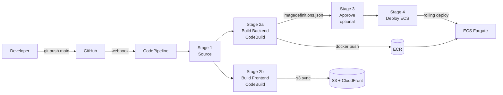

# Stage 12 Deployment: CodePipeline + CodeBuild

## What this stage does

Replaces the manual `docker build → docker push → aws ecs update-service` workflow with a pipeline that triggers automatically on every git push to `main`.

```
git push → Source → Build Backend + Build Frontend (parallel) → [Approve] → Deploy ECS
```

**No application code changes.** Two buildspec files were added to the repo:
- `team-notes-pro/buildspec.yml` — Docker build, ECR push, writes `imagedefinitions.json`
- `team-notes-pro/buildspec-frontend.yml` — npm build, S3 sync, CloudFront invalidation

---

## Architecture



---

## Before you start

Make sure you have the GitHub repo pushed and the `buildspec.yml` and `buildspec-frontend.yml` files are committed at `team-notes-pro/`.

---

## Step 1 — Store build config in SSM Parameter Store

Both buildspecs read these values at build time. Run once:

```bash
aws ssm put-parameter --name "/team-notes-pro/vite-api-url" \
  --value "https://api.notes.ehm23.com" --type String --overwrite

aws ssm put-parameter --name "/team-notes-pro/cognito-user-pool-id" \
  --value "us-east-1_hXPK9kZRa" --type String --overwrite

aws ssm put-parameter --name "/team-notes-pro/cognito-client-id" \
  --value "4309f2d68f7hvnlm0dngndcen8" --type String --overwrite
```

---

## Step 2 — Create the CodeBuild IAM role

Both CodeBuild projects will share this role.

1. Open **IAM → Roles → Create role**
2. Trusted entity: **AWS service → CodeBuild** → Next
3. Attach these two managed policies:
   - `AmazonEC2ContainerRegistryPowerUser`
   - `CloudWatchLogsFullAccess`
4. Name the role: `codebuild-team-notes-pro-role` → Create role
5. Open the role you just created → **Add permissions → Create inline policy → JSON:**

```json
{
  "Version": "2012-10-17",
  "Statement": [
    {
      "Effect": "Allow",
      "Action": ["ssm:GetParameter", "ssm:GetParameters"],
      "Resource": "arn:aws:ssm:us-east-1:853696859325:parameter/team-notes-pro/*"
    },
    {
      "Effect": "Allow",
      "Action": ["s3:PutObject", "s3:DeleteObject", "s3:ListBucket"],
      "Resource": [
        "arn:aws:s3:::team-notes-pro-frontend-853696859325",
        "arn:aws:s3:::team-notes-pro-frontend-853696859325/*"
      ]
    },
    {
      "Effect": "Allow",
      "Action": "cloudfront:CreateInvalidation",
      "Resource": "arn:aws:cloudfront::853696859325:distribution/E3HOSF1U0C2PIG"
    }
  ]
}
```

Name it `team-notes-pro-codebuild-inline` → Create policy.

---

## Step 3 — Connect CodePipeline to GitHub

1. Open **CodePipeline → Settings → Connections → Create connection**
2. Provider: **GitHub** → Connection name: `team-notes-pro-github` → Connect to GitHub
3. Authorize the AWS Connector GitHub App when prompted
4. Click **Connect** — wait for status to show **Available**

---

## Step 4 — Create the pipeline

Open **CodePipeline → Pipelines → Create pipeline**.

### Screen 1 — Choose creation option
- Select **Build custom pipeline**
- Click **Next**

### Screen 2 — Choose source
- **Pipeline name:** `team-notes-pro`
- **Execution mode:** Superseded
- **Service role:** New service role (let AWS create it)
- **Source provider:** GitHub (via GitHub App)
- **Connection:** `team-notes-pro-github`
- **Repository:** your repo (e.g. `your-username/aws-practice-lab-advanced`)
- **Branch:** `main`
- Click **Next**

### Screen 3 — Configure template

This screen lets you add pipeline stages. You need to add a Build stage and a Deploy stage.

**Add the Build stage:**

1. Click **Add build stage**
2. Action name: `BuildBackend`
3. Build provider: **AWS CodeBuild**
4. Click **Create project** — a panel opens. Fill it in:
   - Project name: `team-notes-pro-backend`
   - Environment image: **Managed image**
   - OS: **Amazon Linux** / Runtime: **Standard** / Image: `aws/codebuild/amazonlinux-x86_64-standard:5.0`
   - Privileged: ✅ **Enable** ← required for `docker build`
   - Service role: **Existing role** → `codebuild-team-notes-pro-role`
   - Buildspec: **Use a buildspec file** → name: `team-notes-pro/buildspec.yml`
   - Click **Continue to CodePipeline**
5. Output artifacts: `BackendBuild`

**Add the frontend as a parallel action in the same Build stage:**

6. Look for **Add action** (within the same Build stage, not a new stage) — this adds a parallel action
7. Action name: `BuildFrontend`
8. Build provider: **AWS CodeBuild**
9. Click **Create project**:
   - Project name: `team-notes-pro-frontend`
   - Same environment settings as above
   - Privileged: leave unchecked
   - Service role: `codebuild-team-notes-pro-role`
   - Buildspec: **Use a buildspec file** → `team-notes-pro/buildspec-frontend.yml`
   - Click **Continue to CodePipeline**
10. Output artifacts: leave blank

**Add the Deploy stage:**

11. Click **Add deploy stage**
12. Deploy provider: **Amazon ECS**
13. Input artifact: `BackendBuild`
14. Cluster name: `team-notes-pro`
15. Service name: `team-notes-pro-svc`
16. Image definitions file: `imagedefinitions.json`

Click **Create pipeline**.

The pipeline triggers immediately with the current `main` branch.

---

## Step 5 — Add manual approval (optional)

A manual approval gate lets you review the build output before it deploys to ECS. Useful when you want a human to confirm before a production change goes live.

To add it:
1. Open the pipeline → **Edit**
2. Click **Add stage** between the Build and Deploy stages
3. Stage name: `Approve`
4. Click **Add action group** → Action name: `ManualApproval`, Action provider: **Manual approval**
5. SNS topic ARN: (optional) paste an SNS topic to receive an email when approval is needed
6. Click **Done** → **Save**

---

## Step 6 — Verify the first run

Watch the pipeline execute:

```bash
aws codepipeline get-pipeline-state \
  --name team-notes-pro \
  --query 'stageStates[*].{Stage:stageName,Status:latestExecution.status}' \
  --output table
```

If a build fails, go to **CodeBuild → Build history** → click the failed build → **Build logs** to see the exact error.

Common first-run failures and fixes:

| Error | Fix |
|-------|-----|
| `Error: Cannot perform an interactive login` | Check the CodeBuild role has `AmazonEC2ContainerRegistryPowerUser` |
| `Parameter not found: /team-notes-pro/...` | Re-run Step 1 to create the SSM parameters |
| `AccessDenied on s3:PutObject` | Check the inline policy bucket ARN matches your actual bucket name |
| `AccessDenied on cloudfront:CreateInvalidation` | Check the inline policy distribution ID matches yours |

---

## What happens on each push

```
git push origin main
     │
     ├─ CodePipeline detects the push via GitHub webhook
     ├─ Downloads a zip of the repo into the pipeline artifact bucket
     │
     ├─ [parallel, ~4 min]
     │   ├─ BuildBackend:  docker build → ECR push → imagedefinitions.json
     │   └─ BuildFrontend: npm ci → npm run build → S3 sync → CF invalidate
     │
     ├─ [optional] Manual approval
     │
     └─ Deploy: registers new ECS task definition → rolling deploy
                new tasks start → old tasks drain → service stable
```

Total: ~7 minutes push to live (without approval gate).

---

## Cost

| Resource | Cost |
|----------|------|
| CodePipeline | $1.00/month per active pipeline |
| CodeBuild | Free tier: 100 build-minutes/month. ~8 min per push = ~12 free pushes/month |
| S3 artifact bucket | < $0.01/month |
