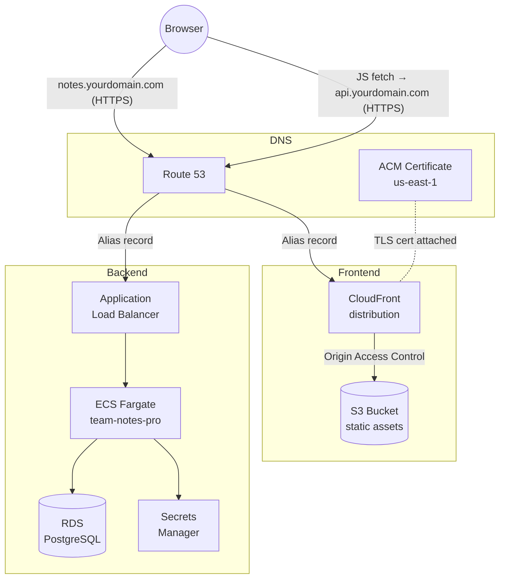

# Stage 3 Deployment: S3 + CloudFront + Route 53 + ACM

## What this stage does

The frontend is separated from the backend container and deployed as static files on S3, delivered globally through CloudFront. The backend API stays on ECS Fargate behind the ALB.

**New AWS services:**

| Service | Role |
|---------|------|
| S3 | Stores the compiled React + Tailwind static files |
| CloudFront | CDN that caches and serves those files from ~400 edge locations worldwide |
| ACM | Provisions and auto-renews the TLS certificate attached to CloudFront |
| Route 53 | DNS — maps your custom domain to CloudFront and the ALB |

**Why not keep the frontend in the container?**
Static files don't need a server process. Serving them from CloudFront is faster (edge cache), cheaper (no ECS CPU/memory cost), and easier to deploy independently of the API.

---

## Architecture



**How the frontend calls the API:**
The React app is built with `VITE_API_URL=https://api.notes.yourdomain.com` baked in at compile time. At runtime the browser fetches `https://api.notes.yourdomain.com/api/notes` — a cross-origin request the backend allows via the `cors` middleware (`CORS_ORIGIN` env var).

---

## Prerequisites

- Stages 1 and 2 complete (ECS Fargate + ALB + RDS running)
- AWS CLI configured (`aws sts get-caller-identity` works)
- A domain name you control (optional — you can use raw AWS hostnames if you don't have one)

---

## Step 1 — Create the S3 bucket

**CLI (straightforward):**

```bash
REGION=us-east-1
ACCOUNT_ID=$(aws sts get-caller-identity --query Account --output text)
BUCKET_NAME=team-notes-pro-frontend-${ACCOUNT_ID}

aws s3api create-bucket --bucket "$BUCKET_NAME" --region "$REGION"

# Block all public access — CloudFront reads the bucket directly via OAC
aws s3api put-public-access-block \
  --bucket "$BUCKET_NAME" \
  --public-access-block-configuration \
    "BlockPublicAcls=true,IgnorePublicAcls=true,BlockPublicPolicy=true,RestrictPublicBuckets=true"
```

> Do **not** enable "Static website hosting" on the bucket. CloudFront is the entry point; the bucket stays private.

---

## Step 2 — Request an ACM certificate

> **CloudFront requires the certificate to live in `us-east-1`**, regardless of where the rest of your infrastructure is.

### Console (recommended)

1. Open **ACM** → make sure the region selector (top-right) is set to **US East (N. Virginia) us-east-1**
2. Click **Request certificate** → **Request a public certificate**
3. Add domain names:
   - `notes.yourdomain.com`
   - `api.notes.yourdomain.com`
4. Validation method: **DNS validation**
5. Click **Request**
6. On the certificate details page, click **Create records in Route 53** (one click adds both CNAME records automatically)
7. Wait ~2 minutes until status shows **Issued**
8. Copy the **Certificate ARN** — you'll need it in Step 3

### CLI alternative

```bash
CERT_ARN=$(aws acm request-certificate \
  --domain-name "notes.yourdomain.com" \
  --subject-alternative-names "api.notes.yourdomain.com" \
  --validation-method DNS \
  --region us-east-1 \
  --query CertificateArn --output text)

echo "Certificate ARN: $CERT_ARN"

# Print the CNAME records to add to your DNS provider
aws acm describe-certificate \
  --certificate-arn "$CERT_ARN" \
  --region us-east-1 \
  --query 'Certificate.DomainValidationOptions[*].{Domain:DomainName,Name:ResourceRecord.Name,Value:ResourceRecord.Value}' \
  --output table
```

---

## Step 3 — Create the CloudFront distribution

This is the most involved step. The console is much easier than the CLI here.

### Console (recommended)

1. Open **CloudFront** → **Create distribution**

2. **Origin:**
   - Origin domain: select your S3 bucket from the dropdown (`team-notes-pro-frontend-XXXX.s3.amazonaws.com`)
   - Origin access: select **Origin access control settings (recommended)**
   - Click **Create new OAC** → accept defaults → **Create**
   - CloudFront will show a banner: *"You must update the S3 bucket policy"* — click **Copy policy**, then open your S3 bucket → **Permissions** → **Bucket policy** → paste and save

3. **Default cache behavior:**
   - Viewer protocol policy: **Redirect HTTP to HTTPS**
   - Allowed HTTP methods: **GET, HEAD**
   - Cache policy: **CachingOptimized** (AWS managed)

4. **Settings:**
   - Alternate domain names (CNAMEs): `notes.yourdomain.com`
   - Custom SSL certificate: select the ACM cert from Step 2
   - Default root object: `index.html`

5. Click **Create distribution** — deployment takes ~5 minutes

6. **Fix React client-side routing** (handles deep links like `/notes/123`):
   - Open the distribution → **Error pages** tab → **Create custom error response**
   - HTTP error code: `403`
   - Response page path: `/index.html`
   - HTTP response code: `200`
   - Click **Create custom error response**

7. Copy the **Distribution ID** and **Distribution domain name** (e.g. `d1abc123.cloudfront.net`) — needed in later steps

### CLI alternative

```bash
# Get these values from Steps 1 and 2
BUCKET_NAME=team-notes-pro-frontend-${ACCOUNT_ID}
CERT_ARN="arn:aws:acm:us-east-1:${ACCOUNT_ID}:certificate/REPLACE_ME"

# Create OAC
OAC_ID=$(aws cloudfront create-origin-access-control \
  --origin-access-control-config '{
    "Name":"team-notes-pro-oac",
    "Description":"",
    "SigningProtocol":"sigv4",
    "SigningBehavior":"always",
    "OriginAccessControlOriginType":"s3"
  }' \
  --query 'OriginAccessControl.Id' --output text)

# Create distribution (writes config to a temp file to avoid shell escaping issues)
cat > /tmp/cf-config.json <<EOF
{
  "CallerReference": "team-notes-pro-$(date +%s)",
  "Comment": "Team Notes Pro frontend",
  "DefaultRootObject": "index.html",
  "Origins": {
    "Quantity": 1,
    "Items": [{
      "Id": "s3-origin",
      "DomainName": "${BUCKET_NAME}.s3.${REGION}.amazonaws.com",
      "S3OriginConfig": { "OriginAccessIdentity": "" },
      "OriginAccessControlId": "${OAC_ID}"
    }]
  },
  "DefaultCacheBehavior": {
    "TargetOriginId": "s3-origin",
    "ViewerProtocolPolicy": "redirect-to-https",
    "CachePolicyId": "658327ea-f89d-4fab-a63d-7e88639e58f6",
    "AllowedMethods": { "Quantity": 2, "Items": ["GET","HEAD"] }
  },
  "CustomErrorResponses": {
    "Quantity": 1,
    "Items": [{
      "ErrorCode": 403,
      "ResponsePagePath": "/index.html",
      "ResponseCode": "200",
      "ErrorCachingMinTTL": 0
    }]
  },
  "Aliases": { "Quantity": 1, "Items": ["notes.yourdomain.com"] },
  "ViewerCertificate": {
    "ACMCertificateArn": "${CERT_ARN}",
    "SSLSupportMethod": "sni-only",
    "MinimumProtocolVersion": "TLSv1.2_2021"
  },
  "Enabled": true
}
EOF

DIST_JSON=$(aws cloudfront create-distribution \
  --distribution-config file:///tmp/cf-config.json)

DIST_ID=$(echo "$DIST_JSON" | jq -r '.Distribution.Id')
DIST_DOMAIN=$(echo "$DIST_JSON" | jq -r '.Distribution.DomainName')
echo "Distribution ID: $DIST_ID"
echo "CloudFront domain: $DIST_DOMAIN"

# Apply the S3 bucket policy so CloudFront can read objects
aws s3api put-bucket-policy --bucket "$BUCKET_NAME" --policy "{
  \"Version\": \"2012-10-17\",
  \"Statement\": [{
    \"Effect\": \"Allow\",
    \"Principal\": { \"Service\": \"cloudfront.amazonaws.com\" },
    \"Action\": \"s3:GetObject\",
    \"Resource\": \"arn:aws:s3:::${BUCKET_NAME}/*\",
    \"Condition\": {
      \"StringEquals\": {
        \"AWS:SourceArn\": \"arn:aws:cloudfront::${ACCOUNT_ID}:distribution/${DIST_ID}\"
      }
    }
  }]
}"
```

---

## Step 4 — Configure Route 53 (if you have a domain)

> Skip this step if you don't have a Route 53 hosted zone — use the raw CloudFront domain (`*.cloudfront.net`) and ALB DNS name in Step 6 instead.

### Console (recommended)

**Frontend record (CloudFront):**
1. Open **Route 53** → **Hosted zones** → click your zone
2. **Create record**
   - Record name: `notes`
   - Record type: **A**
   - Toggle **Alias** ON
   - Route traffic to: **Alias to CloudFront distribution**
   - Select your distribution from the dropdown
   - Click **Create records**

**API record (ALB):**
1. **Create record** again
   - Record name: `api.notes`
   - Record type: **A**
   - Toggle **Alias** ON
   - Route traffic to: **Alias to Application and Classic Load Balancer**
   - Select the region and your ALB from the dropdowns
   - Click **Create records**

### CLI alternative

```bash
HOSTED_ZONE_ID=$(aws route53 list-hosted-zones-by-name \
  --dns-name "yourdomain.com" \
  --query 'HostedZones[0].Id' --output text | sed 's|/hostedzone/||')

DIST_DOMAIN="d1abc123.cloudfront.net"   # from Step 3

ALB_DNS=$(aws elbv2 describe-load-balancers \
  --names team-notes-pro-alb \
  --query 'LoadBalancers[0].DNSName' --output text)

ALB_ZONE=$(aws elbv2 describe-load-balancers \
  --names team-notes-pro-alb \
  --query 'LoadBalancers[0].CanonicalHostedZoneId' --output text)

# Frontend → CloudFront
aws route53 change-resource-record-sets \
  --hosted-zone-id "$HOSTED_ZONE_ID" \
  --change-batch "{\"Changes\":[{\"Action\":\"UPSERT\",\"ResourceRecordSet\":{
    \"Name\":\"notes.yourdomain.com\",\"Type\":\"A\",
    \"AliasTarget\":{\"HostedZoneId\":\"Z2FDTNDATAQYW2\",
    \"DNSName\":\"${DIST_DOMAIN}\",\"EvaluateTargetHealth\":false}}}]}"

# API → ALB
aws route53 change-resource-record-sets \
  --hosted-zone-id "$HOSTED_ZONE_ID" \
  --change-batch "{\"Changes\":[{\"Action\":\"UPSERT\",\"ResourceRecordSet\":{
    \"Name\":\"api.notes.yourdomain.com\",\"Type\":\"A\",
    \"AliasTarget\":{\"HostedZoneId\":\"${ALB_ZONE}\",
    \"DNSName\":\"${ALB_DNS}\",\"EvaluateTargetHealth\":true}}}]}"
```

> `Z2FDTNDATAQYW2` is CloudFront's fixed hosted zone ID — it's the same for every CloudFront distribution.

---

## Step 5 — Build and push the new backend image

Stage 3 adds the `cors` package to the backend. You need to push a new image before updating ECS.

```bash
# One-time setup if these aren't already exported
export AWS_ACCOUNT_ID=$(aws sts get-caller-identity --query Account --output text)
export AWS_REGION=us-east-1
ECR_URI=$AWS_ACCOUNT_ID.dkr.ecr.$AWS_REGION.amazonaws.com/team-notes-pro

# Authenticate Docker with ECR (token valid for 12 hours)
aws ecr get-login-password --region $AWS_REGION \
  | docker login --username AWS --password-stdin \
    $AWS_ACCOUNT_ID.dkr.ecr.$AWS_REGION.amazonaws.com

# Build from team-notes-pro/
docker build \
  --build-arg VITE_API_URL=https://api.notes.yourdomain.com \
  -t team-notes-pro:stage3 .

# Tag and push
docker tag team-notes-pro:stage3 $ECR_URI:stage3
docker tag team-notes-pro:stage3 $ECR_URI:latest
docker push $ECR_URI:stage3
docker push $ECR_URI:latest
```

> The `VITE_API_URL` build arg only affects the frontend bundle baked into the image, which is used by `docker-compose` locally. The production frontend on S3 is built separately in Step 6.

---

## Step 6 — Update ECS with CORS_ORIGIN and the new image

The backend must allow cross-origin requests from the CloudFront domain, and ECS must pull the new image.

### Console

1. Open **ECS** → **Task definitions** → select `team-notes-pro` → click the latest revision → **Create new revision**
2. Under **Container** → click the container:
   - **Image URI**: update the tag to `:stage3` (or `:latest`)
   - Scroll to **Environment variables** → add `CORS_ORIGIN` = `https://notes.yourdomain.com`
3. Click **Create** to save the new revision
4. Open **ECS** → **Clusters** → your cluster → **Services** → `team-notes-pro` → **Update service**
5. Select the new task definition revision → **Update**

### CLI alternative

```bash
# After pushing the new image, force ECS to pull it
aws ecs update-service \
  --cluster team-notes-pro \
  --service team-notes-pro \
  --force-new-deployment
```

(Use this after updating the task definition env var in the console.)

---

## Step 7 — Build and deploy the frontend to S3

**CLI (the deploy script handles this — no console equivalent):**

```bash
# From the team-notes-pro/ directory
S3_BUCKET="team-notes-pro-frontend-${ACCOUNT_ID}" \
CLOUDFRONT_DISTRIBUTION_ID="EXXXXXXXXXX" \
VITE_API_URL="https://api.notes.yourdomain.com" \
  ./infra/stage3/deploy-frontend.sh
```

What the script does:
1. Runs `npm run build` with `VITE_API_URL` baked into the bundle
2. Syncs JS/CSS assets with a 1-year immutable cache header (filenames are content-hashed by Vite)
3. Uploads `index.html` with `no-cache` so users always get the latest entry point
4. Invalidates the CloudFront cache (`/*`)

If you don't have a custom domain yet, use the raw ALB DNS name:

```bash
VITE_API_URL="http://team-notes-pro-alb-XXXX.us-east-1.elb.amazonaws.com"
```

---

## Testing

```bash
# Backend health
curl https://api.notes.yourdomain.com/health

# CORS headers — should show access-control-allow-origin
curl -sI -H "Origin: https://notes.yourdomain.com" \
  https://api.notes.yourdomain.com/api/notes | grep -i access-control

# Frontend
open https://notes.yourdomain.com
```

---

## Local development (unchanged)

Nothing changes locally. The Vite dev proxy still forwards `/api` to `localhost:3000`.

```bash
# Terminal 1 — backend + database
cd team-notes-pro && docker-compose up

# Terminal 2 — frontend with hot reload
cd team-notes-pro/frontend && npm run dev
# → http://localhost:5173
```

---

## Cost estimate

| Service | Typical cost |
|---------|-------------|
| S3 | ~$0.02/month (< 1 GB + minimal requests) |
| CloudFront | Free tier covers 1 TB egress + 10M requests/month |
| ACM | Free when used with CloudFront or ALB |
| Route 53 | $0.50/hosted zone/month + $0.40/1M DNS queries |

CloudFront is effectively free at small scale. The Route 53 hosted zone is the only predictable line item.

---

## What's next — Stage 4

Stage 4 adds **Cognito** for user authentication. Notes become per-user; the backend will validate JWTs before serving the API, and the frontend will show a login screen.
