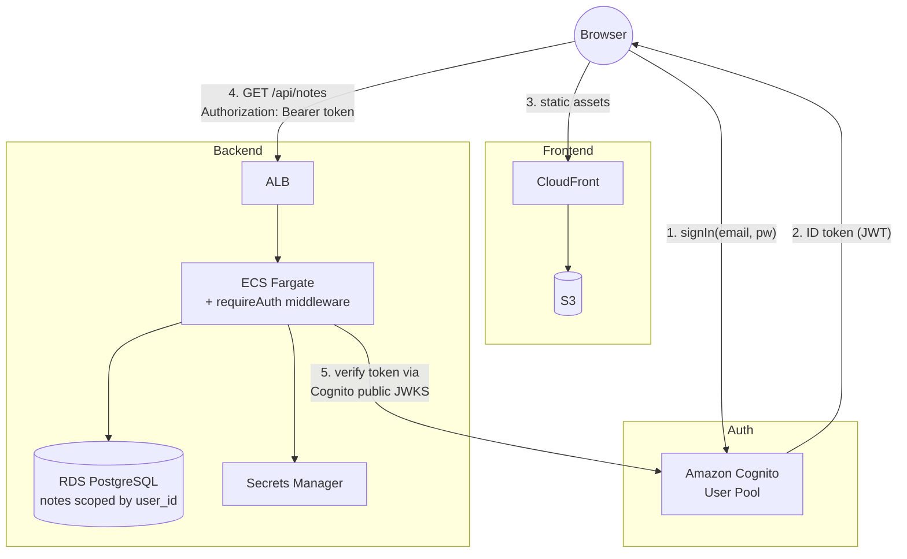

# Stage 4 Deployment: Amazon Cognito

## What this stage does

Users can now sign up, sign in, and sign out. Every note is owned by the user who created it — each user only sees their own notes. The backend validates identity on every API request using a signed JWT issued by Cognito.

**New AWS service: Amazon Cognito**

Cognito is a managed identity service. It handles:
- Storing user accounts and passwords securely (you never touch raw passwords)
- Issuing signed JSON Web Tokens (JWTs) after a successful login
- Token refresh (access tokens expire in 1 hour; refresh tokens last 30 days)
- Email verification during sign-up

You only provision a **User Pool** (the user directory) and an **App Client** (identifies your frontend). No servers to run.

---

## How token validation works

```
Browser                    CloudFront/S3       ALB / ECS Backend        Cognito
  │                             │                      │                    │
  │── POST /login (email+pw) ───────────────────────────────────────────>  │
  │<── ID token (JWT, 1h) ───────────────────────────────────────────────  │
  │                             │                      │                    │
  │── GET / ──────────────────> │                      │                    │
  │<── index.html + JS ──────── │                      │                    │
  │                             │                      │                    │
  │── GET /api/notes ───────────────────────────────>  │                    │
  │   Authorization: Bearer <ID token>                 │                    │
  │                                                    │                    │
  │                                         verify token signature          │
  │                                         (public JWKS, cached)           │
  │                                         check expiry + audience         │
  │<── 200 [{notes…}] ─────────────────────────────────│                    │
```

**No secret key is shared.** Cognito signs tokens with an RSA private key and publishes the corresponding public keys at:
```
https://cognito-idp.{region}.amazonaws.com/{userPoolId}/.well-known/jwks.json
```

The `aws-jwt-verify` library fetches those public keys once at startup (and caches them) to verify every incoming token. The backend only needs the User Pool ID and Client ID — both are non-secret.

---

## Architecture



---

## Prerequisites

- Stages 1–3 complete and running
- AWS CLI configured

---

## Step 1 — Create a Cognito User Pool

### Console (recommended)

1. Open **Cognito** → **User Pools** → **Create user pool**

2. **Authentication providers:**
   - Sign-in options: ✅ **Email**
   - Click **Next**

3. **Security requirements:**
   - Password policy: keep defaults (min 8 chars, uppercase, lowercase, numbers)
   - MFA: **No MFA** (keep it simple for the lab)
   - Click **Next**

4. **Sign-up experience:**
   - Self-service sign-up: ✅ Enabled
   - Required attributes: ✅ **email** (already selected)
   - Click **Next**

5. **Message delivery:**
   - Email provider: **Send email with Cognito** (free, up to 50 emails/day)
   - Click **Next**

6. **Integrate your app:**
   - User pool name: `team-notes-pro`
   - Hosted UI: **Don't use the Hosted UI** (we have a custom login screen)
   - App type: **Public client**
   - App client name: `team-notes-pro-web`
   - Client secret: **Don't generate a client secret** ← important for browser clients
   - Click **Next** → **Create user pool**

7. Copy two values from the pool overview page:
   - **User Pool ID** (e.g. `us-east-1_Ab12Cd34E`)
   - **Client ID** from the **App clients** tab (e.g. `3abc...xyz`)

### CLI alternative

```bash
# Create the pool
POOL_ID=$(aws cognito-idp create-user-pool \
  --pool-name team-notes-pro \
  --policies 'PasswordPolicy={MinimumLength=8,RequireUppercase=true,RequireLowercase=true,RequireNumbers=true}' \
  --auto-verified-attributes email \
  --username-attributes email \
  --query 'UserPool.Id' --output text)
echo "User Pool ID: $POOL_ID"

# Create the app client (no secret — browser app)
CLIENT_ID=$(aws cognito-idp create-user-pool-client \
  --user-pool-id "$POOL_ID" \
  --client-name team-notes-pro-web \
  --no-generate-secret \
  --explicit-auth-flows ALLOW_USER_SRP_AUTH ALLOW_REFRESH_TOKEN_AUTH \
  --query 'UserPoolClient.ClientId' --output text)
echo "Client ID: $CLIENT_ID"
```

---

## Step 2 — Update the backend ECS task definition

Add three environment variables to the ECS task definition.

### Console

1. **ECS** → **Task definitions** → `team-notes-pro` → latest revision → **Create new revision**
2. Click the container → **Environment variables** → add:

| Key | Value |
|-----|-------|
| `COGNITO_USER_POOL_ID` | `us-east-1_XXXXXXXXX` |
| `COGNITO_CLIENT_ID` | `XXXXXXXXXXXXXXXXXXXXXXXXXX` |

3. Remove `DEV_SKIP_AUTH` if it was set.
4. **Create** → update the ECS service to use the new revision.

### CLI alternative

```bash
# Force a new deployment after updating env vars in the console
aws ecs update-service \
  --cluster team-notes-pro \
  --service team-notes-pro \
  --force-new-deployment
```

---

## Step 3 — Build and push the new backend image

```bash
export AWS_ACCOUNT_ID=$(aws sts get-caller-identity --query Account --output text)
export AWS_REGION=us-east-1
ECR_URI=$AWS_ACCOUNT_ID.dkr.ecr.$AWS_REGION.amazonaws.com/team-notes-pro

aws ecr get-login-password --region $AWS_REGION \
  | docker login --username AWS --password-stdin \
    $AWS_ACCOUNT_ID.dkr.ecr.$AWS_REGION.amazonaws.com

cd team-notes-pro

docker build \
  --build-arg VITE_API_URL=https://api.notes.yourdomain.com \
  --build-arg VITE_COGNITO_USER_POOL_ID=us-east-1_XXXXXXXXX \
  --build-arg VITE_COGNITO_CLIENT_ID=XXXXXXXXXXXXXXXXXXXXXXXXXX \
  -t team-notes-pro:stage4 .

docker tag team-notes-pro:stage4 $ECR_URI:stage4
docker tag team-notes-pro:stage4 $ECR_URI:latest
docker push $ECR_URI:stage4
docker push $ECR_URI:latest
```

---

## Step 4 — Build and deploy the frontend to S3

The Cognito env vars must be baked into the frontend bundle at build time.

```bash
S3_BUCKET="team-notes-pro-frontend-${AWS_ACCOUNT_ID}" \
CLOUDFRONT_DISTRIBUTION_ID="EXXXXXXXXXX" \
VITE_API_URL="https://api.notes.yourdomain.com" \
VITE_COGNITO_USER_POOL_ID="us-east-1_XXXXXXXXX" \
VITE_COGNITO_CLIENT_ID="XXXXXXXXXXXXXXXXXXXXXXXXXX" \
  ./infra/stage3/deploy-frontend.sh
```

> The deploy script passes all `VITE_*` env vars to `npm run build` automatically — no changes to the script needed.

Wait, the script uses `VITE_API_URL="$VITE_API_URL" npm run build` — to also pass the Cognito vars, update the build line in `infra/stage3/deploy-frontend.sh` or just export them before running the script (exported env vars are inherited by child processes, so `export VITE_COGNITO_USER_POOL_ID=...` before the script call is enough).

---

## Step 5 — Update the deploy script to pass Cognito vars

Open `infra/stage3/deploy-frontend.sh` and update the build line from:

```bash
VITE_API_URL="$VITE_API_URL" npm run build
```

to:

```bash
VITE_API_URL="$VITE_API_URL" \
VITE_COGNITO_USER_POOL_ID="${VITE_COGNITO_USER_POOL_ID:?VITE_COGNITO_USER_POOL_ID is required}" \
VITE_COGNITO_CLIENT_ID="${VITE_COGNITO_CLIENT_ID:?VITE_COGNITO_CLIENT_ID is required}" \
npm run build
```

---

## Local development

For local dev without a Cognito pool, set `DEV_SKIP_AUTH=true` in your `.env`:

```
DEV_SKIP_AUTH=true
```

This makes the backend inject a fake user (`dev-user` / `dev@local`) for every request, skipping JWT validation. The frontend still needs Cognito env vars — either point it at a real pool or use the `DEV_SKIP_AUTH` path with a local tool like [LocalStack](https://localstack.cloud).

The simplest approach: just use a real Cognito pool (it's free) and set the vars in your local `.env` file.

```
COGNITO_USER_POOL_ID=us-east-1_XXXXXXXXX
COGNITO_CLIENT_ID=XXXXXXXXXXXXXXXXXXXXXXXXXX
VITE_COGNITO_USER_POOL_ID=us-east-1_XXXXXXXXX
VITE_COGNITO_CLIENT_ID=XXXXXXXXXXXXXXXXXXXXXXXXXX
```

---

## Database migration

The `user_id` column is added automatically on server startup via an idempotent `ALTER TABLE ... ADD COLUMN IF NOT EXISTS`. Existing Stage 3 notes get `user_id = 'legacy'` and won't appear under any real user account (which is fine for a learning lab).

If you want to wipe and start clean:
```sql
TRUNCATE notes;
```

---

## Testing

```bash
# Backend health
curl https://api.notes.yourdomain.com/health

# Unauthenticated request should return 401
curl https://api.notes.yourdomain.com/api/notes

# Open the frontend and try sign up → email confirm → sign in
open https://notes.yourdomain.com
```

---

## Cost estimate

| Service | Cost |
|---------|------|
| Cognito User Pool | Free for the first 50,000 MAUs |
| Cognito email delivery | Free up to 50 emails/day via Cognito's built-in sender |

Cognito is effectively free at learning-lab scale. If you exceed 50 sign-up emails/day, switch to SES for email delivery (a few cents per 1,000 emails).

---

## What's next — Stage 5

Stage 5 adds **SQS + a worker ECS task** for async note export jobs. Users can request a full export of their notes; the API queues the job and a separate worker processes it in the background.
