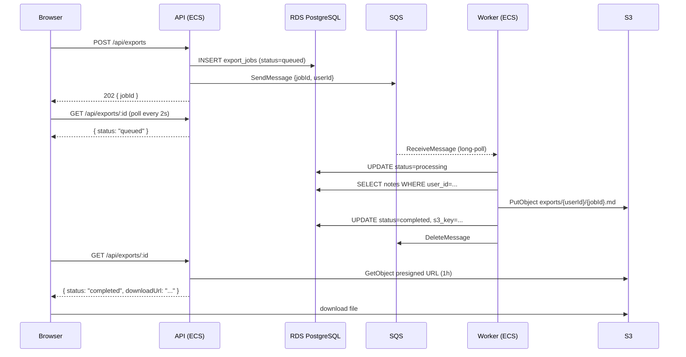

# Stage 5 Deployment: SQS + ECS Worker (Async Export)

## What this stage does

Users can request a full export of their notes. Instead of blocking the HTTP request while the export runs, the API queues the work and returns immediately. A separate worker service picks up the job, generates a Markdown file, uploads it to S3, and updates the job status. The frontend polls for completion and shows a download link.

**New AWS services:**

| Service | Role |
|---------|------|
| SQS (Standard Queue) | Decouples the API from the worker; durably holds jobs until processed |
| S3 (exports bucket) | Stores generated export files; API issues presigned URLs for downloads |
| ECS (worker service) | Second ECS service running `node worker.js` on the same Docker image |

**Why async?**
The export touches every note in the DB, formats them, and uploads a file. That could take seconds — too slow for a synchronous HTTP response. The queue also gives you retry semantics: if the worker crashes mid-job, the message becomes visible again after the visibility timeout.

---

## Queue message shape

```json
{
  "jobId": "550e8400-e29b-41d4-a716-446655440000",
  "userId": "cognito-sub-abc123",
  "requestedAt": "2026-04-29T10:00:00.000Z"
}
```

The worker only needs these three fields. It fetches the user's notes from the DB using `userId`. Keeping the message small avoids SQS's 256 KB payload limit and means the worker always reads fresh data.

---

## Architecture



---

## Step 1 — Create the SQS queue

### Console (recommended)

1. Open **SQS** → **Create queue**
2. Type: **Standard** (not FIFO — order doesn't matter for exports)
3. Name: `team-notes-pro-exports`
4. Leave all defaults (visibility timeout 30 s is fine; increase to 60 s to match the worker)
5. **Optional but recommended — Dead-letter queue:**
   - Create a second queue: `team-notes-pro-exports-dlq`
   - Back in the main queue → **Dead-letter queue** → enable → select the DLQ → max receives: `3`
   - This catches jobs that fail 3 times so you can inspect them
6. Click **Create queue**
7. Copy the **Queue URL** (shown on the queue detail page)

### CLI alternative

```bash
# Create DLQ first
DLQ_ARN=$(aws sqs create-queue \
  --queue-name team-notes-pro-exports-dlq \
  --query 'QueueUrl' --output text | xargs -I{} \
  aws sqs get-queue-attributes --queue-url {} \
  --attribute-names QueueArn --query 'Attributes.QueueArn' --output text)

# Create main queue with DLQ and 60s visibility timeout
QUEUE_URL=$(aws sqs create-queue \
  --queue-name team-notes-pro-exports \
  --attributes "VisibilityTimeout=60,RedrivePolicy={\"deadLetterTargetArn\":\"${DLQ_ARN}\",\"maxReceiveCount\":\"3\"}" \
  --query 'QueueUrl' --output text)

echo "Queue URL: $QUEUE_URL"
```

---

## Step 2 — Create the S3 exports bucket

```bash
ACCOUNT_ID=$(aws sts get-caller-identity --query Account --output text)
EXPORT_BUCKET=team-notes-pro-exports-${ACCOUNT_ID}
REGION=us-east-1

aws s3api create-bucket --bucket "$EXPORT_BUCKET" --region "$REGION"

aws s3api put-public-access-block \
  --bucket "$EXPORT_BUCKET" \
  --public-access-block-configuration \
    "BlockPublicAcls=true,IgnorePublicAcls=true,BlockPublicPolicy=true,RestrictPublicBuckets=true"

# Auto-delete exports after 7 days — they're temporary files
aws s3api put-bucket-lifecycle-configuration \
  --bucket "$EXPORT_BUCKET" \
  --lifecycle-configuration '{
    "Rules": [{
      "ID": "expire-exports",
      "Status": "Enabled",
      "Filter": {"Prefix": "exports/"},
      "Expiration": {"Days": 7}
    }]
  }'
```

---

## Step 3 — IAM permissions

Both ECS services need new IAM permissions. Add these policies to the existing ECS task execution role (or create inline policies).

### Console

**API task role** — add an inline policy:
1. **IAM** → **Roles** → find your ECS task role (e.g. `team-notes-pro-task-role`)
2. **Add permissions** → **Create inline policy** → JSON tab:

```json
{
  "Version": "2012-10-17",
  "Statement": [
    {
      "Effect": "Allow",
      "Action": "sqs:SendMessage",
      "Resource": "arn:aws:sqs:us-east-1:<account_id>:team-notes-pro-exports"
    },
    {
      "Effect": "Allow",
      "Action": "s3:GetObject",
      "Resource": "arn:aws:s3:::team-notes-pro-exports-<account_id>/exports/*"
    }
  ]
}
```

**Worker task role** — add an inline policy:

```json
{
  "Version": "2012-10-17",
  "Statement": [
    {
      "Effect": "Allow",
      "Action": ["sqs:ReceiveMessage", "sqs:DeleteMessage", "sqs:GetQueueAttributes"],
      "Resource": "arn:aws:sqs:us-east-1:<account_id>:team-notes-pro-exports"
    },
    {
      "Effect": "Allow",
      "Action": "s3:PutObject",
      "Resource": "arn:aws:s3:::team-notes-pro-exports-<account_id>/exports/*"
    }
  ]
}
```

The worker also needs DB access — it reuses the same `DB_SECRET_ARN` env var, so its task role must already have `secretsmanager:GetSecretValue` (same as the API).

---

## Step 4 — Build and push the new image

```bash
export AWS_ACCOUNT_ID=$(aws sts get-caller-identity --query Account --output text)
export AWS_REGION=us-east-1
ECR_URI=$AWS_ACCOUNT_ID.dkr.ecr.$AWS_REGION.amazonaws.com/team-notes-pro

aws ecr get-login-password --region $AWS_REGION \
  | docker login --username AWS --password-stdin \
    $AWS_ACCOUNT_ID.dkr.ecr.$AWS_REGION.amazonaws.com

cd team-notes-pro

docker build \
  --build-arg VITE_API_URL=https://api.notes.yourdomain.com \
  --build-arg VITE_COGNITO_USER_POOL_ID=us-east-1_XXXXXXXXX \
  --build-arg VITE_COGNITO_CLIENT_ID=XXXXXXXXXXXXXXXXXXXXXXXXXX \
  -t team-notes-pro:stage5 .

docker tag team-notes-pro:stage5 $ECR_URI:stage5
docker tag team-notes-pro:stage5 $ECR_URI:latest
docker push $ECR_URI:stage5
docker push $ECR_URI:latest
```

---

## Step 5 — Update API task definition and service

### Console

1. **ECS** → **Task definitions** → `team-notes-pro` → **Create new revision**
2. Add env vars to the container:

| Key | Value |
|-----|-------|
| `SQS_QUEUE_URL` | `https://sqs.us-east-1.amazonaws.com/<account>/team-notes-pro-exports` |
| `EXPORT_BUCKET` | `team-notes-pro-exports-<account_id>` |

3. Update the ECS service to use the new revision → **Force new deployment**

---

## Step 6 — Create the worker ECS service

The worker runs the same image as the API but overrides the command to `node worker.js`. It doesn't need a load balancer or exposed port.

### Console

1. **ECS** → **Clusters** → your cluster → **Create service**

2. **Compute:** Fargate

3. **Task definition:** create a **new task definition** (not a revision of the API one):
   - Name: `team-notes-pro-worker`
   - Container: same image URI (`$ECR_URI:latest`)
   - Command override: `node,worker.js`
   - Environment variables:
     - `DB_SECRET_ARN` — same value as the API
     - `AWS_REGION` — `us-east-1`
     - `SQS_QUEUE_URL` — queue URL from Step 1
     - `EXPORT_BUCKET` — bucket name from Step 2
   - **No port mappings** (worker doesn't serve HTTP)

4. **Service settings:**
   - Name: `team-notes-pro-worker`
   - Desired tasks: **1**
   - No load balancer
   - Same VPC + private subnets as the API
   - Same security group (needs outbound HTTPS for SQS/S3 API calls)

5. Click **Create**

### CLI alternative

```bash
# Register worker task definition
aws ecs register-task-definition --cli-input-json '{
  "family": "team-notes-pro-worker",
  "networkMode": "awsvpc",
  "requiresCompatibilities": ["FARGATE"],
  "cpu": "256",
  "memory": "512",
  "executionRoleArn": "arn:aws:iam::<account>:role/ecsTaskExecutionRole",
  "taskRoleArn": "arn:aws:iam::<account>:role/team-notes-pro-worker-task-role",
  "containerDefinitions": [{
    "name": "worker",
    "image": "<ecr_uri>:latest",
    "command": ["node", "worker.js"],
    "environment": [
      {"name": "SQS_QUEUE_URL",  "value": "<queue_url>"},
      {"name": "EXPORT_BUCKET",  "value": "<bucket_name>"},
      {"name": "DB_SECRET_ARN",  "value": "<secret_arn>"},
      {"name": "AWS_REGION",     "value": "us-east-1"}
    ],
    "logConfiguration": {
      "logDriver": "awslogs",
      "options": {
        "awslogs-group": "/ecs/team-notes-pro-worker",
        "awslogs-region": "us-east-1",
        "awslogs-stream-prefix": "worker"
      }
    }
  }]
}'

# Create service
aws ecs create-service \
  --cluster team-notes-pro \
  --service-name team-notes-pro-worker \
  --task-definition team-notes-pro-worker \
  --desired-count 1 \
  --launch-type FARGATE \
  --network-configuration "awsvpcConfiguration={subnets=[<subnet1>,<subnet2>],securityGroups=[<sg>]}"
```

---

## Step 7 — Deploy frontend to S3

```bash
S3_BUCKET="team-notes-pro-frontend-${AWS_ACCOUNT_ID}" \
CLOUDFRONT_DISTRIBUTION_ID="EXXXXXXXXXX" \
VITE_API_URL="https://api.notes.yourdomain.com" \
VITE_COGNITO_USER_POOL_ID="us-east-1_XXXXXXXXX" \
VITE_COGNITO_CLIENT_ID="XXXXXXXXXXXXXXXXXXXXXXXXXX" \
  ./infra/stage3/deploy-frontend.sh
```

---

## Local development

The export feature requires real AWS (SQS + S3). Without those env vars, the API returns `503` when Export is clicked — the rest of the app works normally.

To test exports locally with real AWS:

```bash
# Terminal 1 — API + DB
SQS_QUEUE_URL=https://sqs.us-east-1.amazonaws.com/... \
EXPORT_BUCKET=team-notes-pro-exports-... \
docker compose up app db

# Terminal 2 — Worker (opt-in profile)
SQS_QUEUE_URL=... EXPORT_BUCKET=... \
docker compose --profile worker up worker

# Terminal 3 — Frontend dev server
cd frontend && npm run dev
```

---

## Testing

```bash
# 1. Get a token (sign in via the UI and copy it from browser devtools → Application → localStorage)
TOKEN="eyJ..."

# 2. Request an export
JOB=$(curl -s -X POST https://api.notes.yourdomain.com/api/exports \
  -H "Authorization: Bearer $TOKEN" | jq -r '.jobId')
echo "Job: $JOB"

# 3. Poll until complete
curl -s "https://api.notes.yourdomain.com/api/exports/$JOB" \
  -H "Authorization: Bearer $TOKEN" | jq .

# 4. Download the export
curl -L "$(curl -s "https://api.notes.yourdomain.com/api/exports/$JOB" \
  -H "Authorization: Bearer $TOKEN" | jq -r '.downloadUrl')"
```

---

## Cost estimate

| Service | Cost |
|---------|------|
| SQS Standard | Free for first 1M requests/month |
| S3 (exports bucket) | ~$0.00 — files expire after 7 days, tiny at this scale |
| ECS Fargate (worker) | ~$5–10/month for 0.25 vCPU / 0.5 GB running continuously |

**Cost tip:** The worker task runs 24/7 but spends almost all its time blocked on the SQS long-poll. If cost matters, set the worker's desired count to 0 and scale it with an EventBridge rule or auto-scaling based on queue depth (covered in Stage 9).

---

## What's next — Stage 6

Stage 6 adds **ElastiCache (Redis)** to cache the notes list. The first request populates the cache; subsequent requests skip the DB entirely. Notes are evicted from the cache on write.
