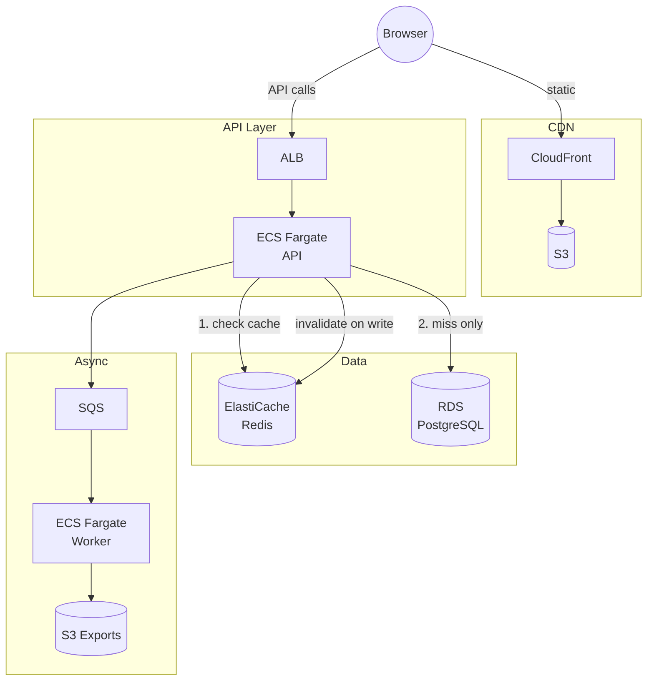

# Stage 6 Deployment: ElastiCache (Redis)

## What this stage does

`GET /api/notes` now checks Redis before touching the database. On the first request after a write the result is fetched from PostgreSQL and stored in Redis for 60 seconds. Subsequent reads within that window are served entirely from cache.

**New AWS service: Amazon ElastiCache for Redis**

ElastiCache is a managed in-memory data store. AWS handles provisioning, patching, failover, and backups. You point the application at the endpoint and use it like any Redis server.

---

## How cache invalidation works

```
GET /api/notes
  ├─ cache hit  → return cached list (no DB call)
  └─ cache miss → query DB → store in cache (TTL 60 s) → return list

POST /api/notes  (create)
  └─ insert into DB → delete cache key → return new note

DELETE /api/notes/:id
  └─ delete from DB → delete cache key → return 204
```

**We delete, not update.** Patching a stale cached array in-place is error-prone — what if two API tasks run concurrently? Deleting the key is one atomic operation. The next `GET` rebuilds the list from a fresh DB read.

**The 60-second TTL** is a safety net, not the primary mechanism. If a bug causes an invalidation to be missed, stale data expires in at most 60 seconds. Rely on the explicit `del` calls for correctness.

**Cache key:** `notes:{userId}` — one key per authenticated user. No cross-user data leaks are possible.

---

## Architecture



---

## Prerequisites

- Stages 1–5 complete
- ElastiCache and the ECS cluster must be in the same VPC

---

## Step 1 — Create the ElastiCache cluster

### Console (recommended)

1. Open **ElastiCache** → **Redis OSS caches** → **Create Redis OSS cache**

2. **Deployment option:** Choose **Design your own cache** → **Cluster cache**

3. **Cluster info:**
   - Name: `team-notes-pro`
   - Engine version: **7.x** (latest stable)
   - Port: `6379`

4. **Cluster settings:**
   - Node type: **cache.t4g.micro** (~$12/month) — sufficient for a learning lab
   - Number of replicas: **0** (single node is fine; add a replica for Stage 9+ HA)

5. **Subnet group:**
   - Create new → name: `team-notes-pro-cache`
   - VPC: select the same VPC as your ECS cluster
   - Subnets: select the **private** subnets

6. **Security:**
   - Encryption in transit: your choice (enable if compliance requires it — use `rediss://` in the URL if you do)
   - Encryption at rest: enable (no performance cost)
   - No auth token needed for a private VPC cluster

7. Click **Create** — takes ~3 minutes

8. Once available, copy the **Primary endpoint** from the cluster detail page:
   ```
   team-notes-pro.xxxxxx.0001.use1.cache.amazonaws.com:6379
   ```

### CLI alternative

```bash
# Get a private subnet ID from your VPC
SUBNET_ID=$(aws ec2 describe-subnets \
  --filters "Name=tag:Name,Values=*private*" \
  --query 'Subnets[0].SubnetId' --output text)

VPC_ID=$(aws ec2 describe-subnets \
  --subnet-ids "$SUBNET_ID" \
  --query 'Subnets[0].VpcId' --output text)

# Create subnet group
aws elasticache create-cache-subnet-group \
  --cache-subnet-group-name team-notes-pro-cache \
  --cache-subnet-group-description "Team Notes Pro cache" \
  --subnet-ids "$SUBNET_ID"

# Create single-node Redis cluster
aws elasticache create-cache-cluster \
  --cache-cluster-id team-notes-pro \
  --cache-node-type cache.t4g.micro \
  --engine redis \
  --engine-version 7.0 \
  --num-cache-nodes 1 \
  --cache-subnet-group-name team-notes-pro-cache \
  --port 6379

# Wait for it to be available (takes ~3 minutes)
aws elasticache wait cache-cluster-available \
  --cache-cluster-id team-notes-pro

# Get the endpoint
aws elasticache describe-cache-clusters \
  --cache-cluster-id team-notes-pro \
  --show-cache-node-info \
  --query 'CacheClusters[0].CacheNodes[0].Endpoint'
```

---

## Step 2 — Security group

The ECS security group must be allowed to reach Redis on port 6379.

### Console

1. **EC2 → Security Groups** → find or create a security group for ElastiCache (e.g. `team-notes-pro-cache-sg`)
2. **Inbound rules → Edit → Add rule:**
   - Type: **Custom TCP**
   - Port: **6379**
   - Source: the ECS task security group (the same one the API uses)
3. Assign this security group to your ElastiCache cluster:
   **ElastiCache → your cluster → Modify → Security groups**

### CLI alternative

```bash
ECS_SG=sg-XXXXXXXXXX   # security group used by ECS API tasks

# Create a dedicated SG for the cache cluster
CACHE_SG=$(aws ec2 create-security-group \
  --group-name team-notes-pro-cache-sg \
  --description "ElastiCache Redis for Team Notes Pro" \
  --vpc-id "$VPC_ID" \
  --query 'GroupId' --output text)

aws ec2 authorize-security-group-ingress \
  --group-id "$CACHE_SG" \
  --protocol tcp \
  --port 6379 \
  --source-group "$ECS_SG"
```

---

## Step 3 — Update the ECS task definition

### Console

1. **ECS → Task definitions → team-notes-pro** → Create new revision
2. Container → Environment variables → add:

| Key | Value |
|-----|-------|
| `REDIS_URL` | `redis://team-notes-pro.xxxxxx.0001.use1.cache.amazonaws.com:6379` |

3. Create revision → update the ECS service → Force new deployment

### CLI alternative

```bash
aws ecs update-service \
  --cluster team-notes-pro \
  --service team-notes-pro \
  --force-new-deployment
```

(After adding `REDIS_URL` to the task definition via console.)

---

## Step 4 — Build and push the new image

```bash
export AWS_ACCOUNT_ID=$(aws sts get-caller-identity --query Account --output text)
export AWS_REGION=us-east-1
ECR_URI=$AWS_ACCOUNT_ID.dkr.ecr.$AWS_REGION.amazonaws.com/team-notes-pro

aws ecr get-login-password --region $AWS_REGION \
  | docker login --username AWS --password-stdin \
    $AWS_ACCOUNT_ID.dkr.ecr.$AWS_REGION.amazonaws.com

cd team-notes-pro

docker build \
  --build-arg VITE_API_URL=https://api.notes.yourdomain.com \
  --build-arg VITE_COGNITO_USER_POOL_ID=us-east-1_XXXXXXXXX \
  --build-arg VITE_COGNITO_CLIENT_ID=XXXXXXXXXXXXXXXXXXXXXXXXXX \
  -t team-notes-pro:stage6 .

docker tag team-notes-pro:stage6 $ECR_URI:stage6
docker tag team-notes-pro:stage6 $ECR_URI:latest
docker push $ECR_URI:stage6
docker push $ECR_URI:latest
```

---

## Testing

```bash
# Cache miss — first request hits the DB
curl -s https://api.notes.yourdomain.com/api/notes \
  -H "Authorization: Bearer $TOKEN" | jq length

# Cache hit — same request, should be faster (check Redis directly if you have access)
curl -s https://api.notes.yourdomain.com/api/notes \
  -H "Authorization: Bearer $TOKEN" | jq length

# Verify invalidation: create a note, then GET should return the updated list
curl -s -X POST https://api.notes.yourdomain.com/api/notes \
  -H "Authorization: Bearer $TOKEN" \
  -H "Content-Type: application/json" \
  -d '{"title":"Cache test","content":"Does invalidation work?"}' | jq .

curl -s https://api.notes.yourdomain.com/api/notes \
  -H "Authorization: Bearer $TOKEN" | jq length
```

**Inspect Redis directly** from inside the VPC (e.g., via an ECS exec session):

```bash
# Connect to Redis
redis-cli -h team-notes-pro.xxxxxx.0001.use1.cache.amazonaws.com

# Check if a user's notes are cached
KEYS notes:*
GET notes:cognito-sub-abc123

# See TTL remaining
TTL notes:cognito-sub-abc123
```

---

## Local development

Redis is now included in `docker-compose.yml`. No extra setup needed:

```bash
docker compose up        # starts app + db + redis
cd frontend && npm run dev
```

The app starts without Redis too (e.g. if you run the backend directly with `node server.js` and no `REDIS_URL` set) — the cache module returns a no-op in that case and every request falls through to the DB.

---

## Cost estimate

| Service | Cost |
|---------|------|
| cache.t4g.micro (single node) | ~$12/month |
| cache.t3.micro (alternative) | ~$14/month |
| ElastiCache Serverless | $0.00125/ECU-hour + $0.125/GB-hour — cheaper at very low usage |

**Cost tip:** Delete the cluster when not actively learning. ElastiCache charges by the hour even when idle. Unlike RDS there's no easy "stop" — you have to delete and recreate. Take a snapshot first if you want to restore configuration later.

---

## What's next — Stage 7

Stage 7 adds **SNS** to notify users when their export job completes — the worker publishes a message to an SNS topic, which can fan out to email, SMS, or other queues.
