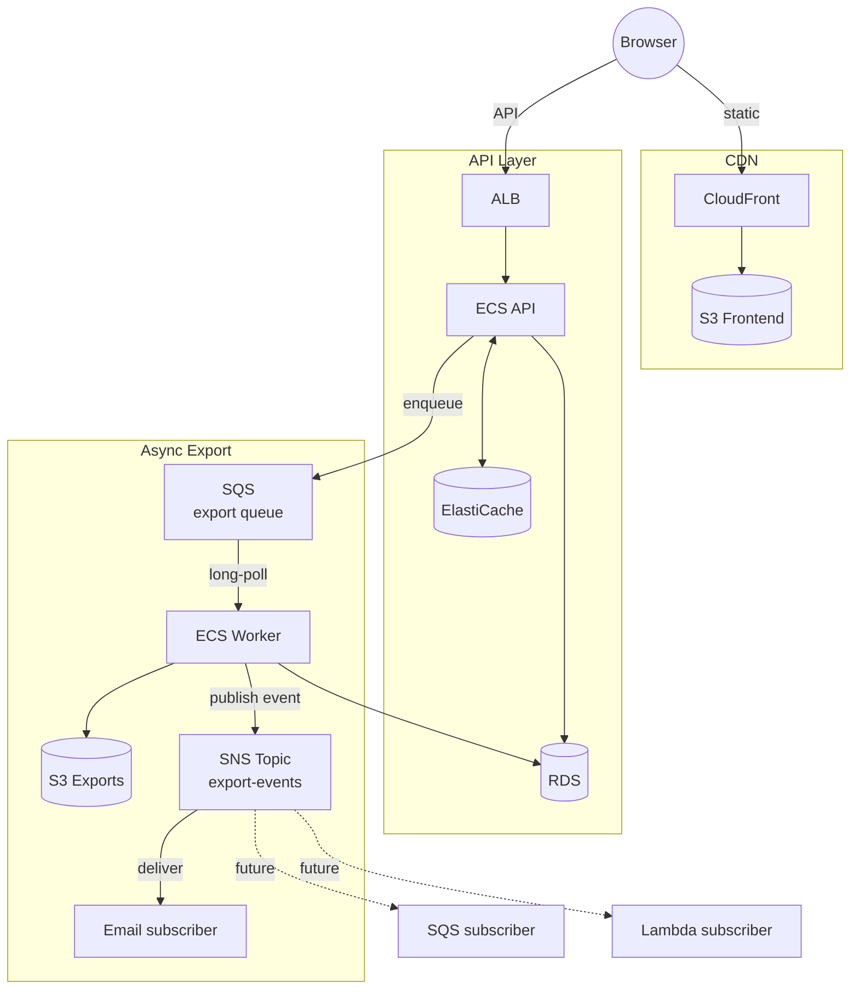

# Stage 7 Deployment: Amazon SNS (Export Notifications)

## What this stage does

When the export worker finishes a job it publishes one event to an SNS topic. SNS delivers that event to every subscriber — in this stage, an email address. In a future stage you could add an SQS queue, a Lambda function, or an SMS number as additional subscribers without touching the worker code.

**New AWS service: Amazon Simple Notification Service (SNS)**

SNS is a pub/sub service. One publisher, many subscribers. It does not store messages — delivery is immediate and at-most-once per subscriber.

---

## SQS vs SNS — when to use which

| | SQS | SNS |
|---|---|---|
| **Model** | Queue (one consumer processes each message) | Pub/sub (every subscriber gets a copy) |
| **Delivery** | Stored until a consumer pulls it | Pushed immediately to all subscribers |
| **Use when** | One thing needs to do one unit of work | Multiple things need to react to the same event |
| **This project** | Worker pulls export jobs — exactly one worker processes each job | Notify email + (later) Slack + metrics when a job completes |

In this project both services are used together: SQS serialises the work (one worker, one job), SNS broadcasts the outcome (email, future subscribers).

---

## Notification event shape

Published as the SNS `Message` body. Email subscribers receive it as formatted JSON. Future SQS or Lambda subscribers parse it programmatically.

**Export completed:**
```json
{
  "event":       "export.completed",
  "jobId":       "550e8400-e29b-41d4-a716-446655440000",
  "userId":      "cognito-sub-abc123",
  "userEmail":   "user@example.com",
  "noteCount":   5,
  "completedAt": "2026-04-29T10:00:05.000Z"
}
```

**Export failed:**
```json
{
  "event":     "export.failed",
  "jobId":     "550e8400-e29b-41d4-a716-446655440000",
  "userId":    "cognito-sub-abc123",
  "userEmail": "user@example.com",
  "error":     "connect ETIMEDOUT 10.0.1.36:5432",
  "failedAt":  "2026-04-29T10:00:03.000Z"
}
```

The `MessageAttribute` `event` is set on every publish so future subscribers can use SNS filter policies to receive only completed events, only failed events, or both — without any code change.

---

## Architecture



---

## Step 1 — Create the SNS topic

### Console (recommended)

1. Open **SNS** → **Topics** → **Create topic**
2. Type: **Standard** (not FIFO — notifications don't need ordering)
3. Name: `team-notes-pro-export-events`
4. Leave all other settings as defaults
5. Click **Create topic**
6. Copy the **Topic ARN** — you'll need it in every step below:
   ```
   arn:aws:sns:us-east-1:<account_id>:team-notes-pro-export-events
   ```

### CLI alternative

```bash
TOPIC_ARN=$(aws sns create-topic \
  --name team-notes-pro-export-events \
  --query 'TopicArn' --output text)

echo "Topic ARN: $TOPIC_ARN"
```

---

## Step 2 — Subscribe an email address

### Console

1. On the topic detail page → **Create subscription**
2. Protocol: **Email**
3. Endpoint: your email address (or an ops mailbox)
4. Click **Create subscription**
5. Check your inbox — AWS sends a confirmation email
6. Click **Confirm subscription** in that email

### CLI alternative

```bash
aws sns subscribe \
  --topic-arn "$TOPIC_ARN" \
  --protocol email \
  --notification-endpoint you@example.com
```

Then click the confirmation link in the email AWS sends.

> **One email for everyone?** For this stage we subscribe one ops/admin address. In a real app you'd build per-user subscriptions (e.g. the API calls `sns.subscribe()` when a user opts in) or fan out to a Lambda that sends personalised emails via SES. Either approach adds complexity — the worker stays unchanged.

---

## Step 3 — IAM permission for the worker

The worker's ECS task role needs permission to publish to the topic.

### Console

1. **IAM → Roles** → find the worker task role (the one attached to the `team-notes-pro-worker` ECS task definition)
2. **Add permissions → Create inline policy → JSON:**

```json
{
  "Version": "2012-10-17",
  "Statement": [{
    "Effect": "Allow",
    "Action": "sns:Publish",
    "Resource": "arn:aws:sns:us-east-1:<account_id>:team-notes-pro-export-events"
  }]
}
```

3. Name the policy `team-notes-pro-worker-sns` → **Create policy**

### CLI alternative

```bash
WORKER_ROLE=team-notes-pro-worker-task-role   # replace with your actual role name
TOPIC_ARN=arn:aws:sns:us-east-1:<account_id>:team-notes-pro-export-events

aws iam put-role-policy \
  --role-name "$WORKER_ROLE" \
  --policy-name team-notes-pro-worker-sns \
  --policy-document "{
    \"Version\": \"2012-10-17\",
    \"Statement\": [{
      \"Effect\": \"Allow\",
      \"Action\": \"sns:Publish\",
      \"Resource\": \"$TOPIC_ARN\"
    }]
  }"
```

---

## Step 4 — Update the worker ECS task definition

The worker needs `SNS_TOPIC_ARN` added, and its health check must be fixed.

**Why the health check matters:** The Dockerfile bakes in `HEALTHCHECK CMD wget -qO- http://localhost:3000/health` for the API. The worker uses the same image but runs no HTTP server, so that check always fails → ECS marks the task unhealthy → task stops. The fix is to override the health check in the worker task definition with a process-level check instead.

### Console

1. **ECS → Task definitions → team-notes-pro-worker** → Create new revision
2. Container → **Environment variables** → add:

| Key | Value |
|-----|-------|
| `SNS_TOPIC_ARN` | `arn:aws:sns:us-east-1:<account_id>:team-notes-pro-export-events` |

3. Container → **Health check** → set:
   - Command: `CMD-SHELL, kill -0 1`
   - Interval: `30`
   - Timeout: `5`
   - Start period: `30`
   - Retries: `3`

   `kill -0 1` checks that PID 1 (the node process) is alive without sending a signal — no HTTP endpoint needed.

4. Create revision → **ECS → Services → team-notes-pro-worker → Update service** → select new revision → **Force new deployment**

---

## Step 5 — Build and push the updated image

```bash
export AWS_ACCOUNT_ID=$(aws sts get-caller-identity --query Account --output text)
export AWS_REGION=us-east-1
ECR_URI=$AWS_ACCOUNT_ID.dkr.ecr.$AWS_REGION.amazonaws.com/team-notes-pro

aws ecr get-login-password --region $AWS_REGION \
  | docker login --username AWS --password-stdin \
    $AWS_ACCOUNT_ID.dkr.ecr.$AWS_REGION.amazonaws.com

cd team-notes-pro

docker build \
  --build-arg VITE_API_URL=https://api.notes.yourdomain.com \
  --build-arg VITE_COGNITO_USER_POOL_ID=us-east-1_XXXXXXXXX \
  --build-arg VITE_COGNITO_CLIENT_ID=XXXXXXXXXXXXXXXXXXXXXXXXXX \
  -t team-notes-pro:stage7 .

docker tag team-notes-pro:stage7 $ECR_URI:stage7
docker tag team-notes-pro:stage7 $ECR_URI:latest
docker push $ECR_URI:stage7
docker push $ECR_URI:latest
```

---

## Testing

Trigger an export from the UI and wait for it to complete, then check your inbox. Or via CLI:

```bash
TOKEN="eyJ..."   # from browser devtools

# Request export
JOB=$(curl -s -X POST https://api.notes.yourdomain.com/api/exports \
  -H "Authorization: Bearer $TOKEN" | jq -r '.jobId')

# Poll until done
watch -n 2 "curl -s https://api.notes.yourdomain.com/api/exports/$JOB \
  -H 'Authorization: Bearer $TOKEN' | jq .status"
```

Within a few seconds of the job reaching `completed` or `failed`, the subscribed email address should receive a message.

> **If the worker task keeps stopping as UNHEALTHY:** check that the `CMD-SHELL, kill -0 1` health check override is on the revision the service is actually running. Confirm with:
> ```bash
> aws ecs describe-task-definition \
>   --task-definition team-notes-pro-worker \
>   --query 'taskDefinition.containerDefinitions[0].healthCheck'
> ```
> The `command` field must be `["CMD-SHELL","kill -0 1"]`, not `["NONE"]`. Also confirm the running task is on that revision:
> ```bash
> aws ecs list-tasks --cluster team-notes-pro \
>   --service-name team-notes-pro-worker --output text --query 'taskArns[0]' \
> | xargs -I{} aws ecs describe-tasks --cluster team-notes-pro --tasks {} \
>   --query 'tasks[0].taskDefinitionArn'
> ```

You can also publish a test message directly to verify email delivery without running a real export:

```bash
aws sns publish \
  --topic-arn "$TOPIC_ARN" \
  --subject "Test: export.completed" \
  --message '{"event":"export.completed","jobId":"test-123","noteCount":3}'
```

---

## Local development

`SNS_TOPIC_ARN` is not set in `docker-compose.yml`. The worker's `publishEvent` function checks for a non-null `sns` client before publishing and returns immediately if it's null — no error, no config required locally. Everything else works as before.

---

## Cost estimate

| Resource | Cost |
|----------|------|
| SNS publishes | Free for first 1M/month |
| Email delivery via SNS | Free for first 1,000/month |
| Email delivery via SES (future) | $0.10 per 1,000 emails |

SNS is effectively free at learning-lab scale.

---

## What's next — Stage 8

Stage 8 adds **Step Functions** to orchestrate the export as a multi-step state machine: validate → fetch notes → generate file → upload → notify. This replaces the single `processJob` function with a visible, auditable workflow that can retry individual steps and branch on failure.
