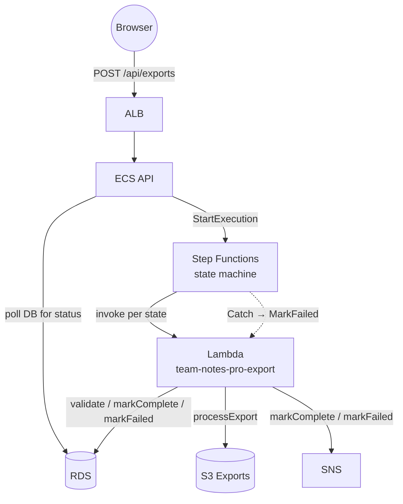

# Stage 8 Deployment: AWS Step Functions

## Why orchestration is useful here

The Stage 5–7 worker had one `processJob` function with a try/catch block. Everything happened inside that block: update DB, query notes, generate markdown, upload S3, update DB again, publish SNS. If the S3 upload failed after the first DB update, the job was stuck in `processing`. If the worker crashed between steps, there was no record of which step failed or why.

Step Functions solves this by making each step **explicit and visible**:

- Every state transition is logged. You can open the console and see exactly which step failed and what the input/output was.
- Retry and catch logic lives in the state machine definition, not buried in application code.
- Each step gets a clean input and produces a clean output — no side-effect coupling between steps.
- The workflow is auditable long after the execution finishes.

**What changed:** The API now starts a Step Functions execution instead of sending to SQS. The SQS worker is no longer involved in exports (it can be scaled to 0). A Lambda function handles the actual work, invoked once per step.

---

## Architecture



---

## State machine flow

```
                  ┌──────────┐
     START ──────▶│ Validate │── error ──┐
                  └────┬─────┘           │
                       │                 │
                  ┌────▼──────┐          │
                  │ FetchNotes│── error ─┤
                  └────┬──────┘          │
                       │                 │
                  ┌────▼────────┐        │
                  │ProcessExport│─ error ┤
                  └────┬────────┘        │
                       │                 │
                  ┌────▼──────────┐      │
                  │  MarkComplete │─────▶│
                  └──────────────┘       │
                                    ┌────▼──────┐
                                    │ MarkFailed│
                                    └───────────┘
```

Each step calls the same Lambda function with a different `action`. Step Functions passes only the fields each state needs, and stores each result at a dedicated path in the execution state.

**How data flows through the state machine:**

```
Input:          { jobId, userId }
After Validate: { jobId, userId, validate: { ok: true } }
After Fetch:    { ..., fetch: { notes: [...], userEmail, noteCount } }
After Process:  { ..., process: { s3Key: "exports/..." } }
MarkComplete receives: jobId, userId, s3Key, userEmail, noteCount
```

The `notes` array travels through state between FetchNotes and ProcessExport. This is fine for small note sets. The Step Functions execution state limit is 256 KB — if a user had thousands of large notes you'd store them in S3 instead of passing through state.

---

## Step 1 — Create the Lambda function

### Package the Lambda code

The Lambda function reuses `backend/lambda.js` and its dependencies (`db.js`, `@aws-sdk/*`, `pg`). You need to zip the backend directory (minus dev dependencies) and upload it.

```bash
cd team-notes-pro/backend

# Install prod deps only into a clean directory
rm -rf /tmp/lambda-pkg && mkdir /tmp/lambda-pkg
cp lambda.js db.js package.json /tmp/lambda-pkg/
cd /tmp/lambda-pkg && npm install --omit=dev
cd /tmp/lambda-pkg && zip -r /tmp/lambda.zip .

echo "Package size: $(du -sh /tmp/lambda.zip)"
```

### Create the function

### Console (recommended)

1. Open **Lambda** → **Create function**
2. **Author from scratch**
   - Name: `team-notes-pro-export`
   - Runtime: **Node.js 20.x**
   - Architecture: x86_64
3. Click **Create function**
4. **Code** tab → **Upload from** → **.zip file** → upload `/tmp/lambda.zip`
5. **Runtime settings** → Handler: `lambda.handler`

### CLI alternative

```bash
ACCOUNT_ID=$(aws sts get-caller-identity --query Account --output text)
REGION=us-east-1

aws lambda create-function \
  --function-name team-notes-pro-export \
  --runtime nodejs20.x \
  --role "arn:aws:iam::${ACCOUNT_ID}:role/team-notes-pro-lambda-role" \
  --handler lambda.handler \
  --zip-file fileb:///tmp/lambda.zip \
  --timeout 60 \
  --memory-size 256 \
  --region $REGION
```

> To update after code changes: `aws lambda update-function-code --function-name team-notes-pro-export --zip-file fileb:///tmp/lambda.zip`

---

## Step 2 — Configure the Lambda function

### VPC (required for RDS access)

The Lambda function needs to be in the same VPC as RDS to reach PostgreSQL.

### Console

1. Lambda function → **Configuration** → **VPC** → **Edit**
2. Select the same VPC, private subnets, and security group used by the ECS API service
3. Save — Lambda will now route through the VPC for DB connections

> Lambda in a VPC loses default internet access. It reaches S3 and SNS via **VPC endpoints** (Gateway endpoint for S3, Interface endpoint for SNS) or a **NAT Gateway**. If you already have a NAT Gateway from Stage 1, Lambda will use it automatically.

### Environment variables

**Lambda** → **Configuration** → **Environment variables** → add:

| Key | Value |
|-----|-------|
| `DB_SECRET_ARN` | `arn:aws:secretsmanager:us-east-1:<account_id>:secret:team-notes-pro/db-...` |
| `EXPORT_BUCKET` | `team-notes-pro-exports-<account_id>` |
| `SNS_TOPIC_ARN` | `arn:aws:sns:us-east-1:<account_id>:team-notes-pro-export-events` |

> Do **not** add `AWS_REGION` — Lambda reserves it and sets it automatically. Adding it manually causes:
> `Reserved keys used in this request: AWS_REGION`

### Timeout

Lambda → **Configuration** → **General configuration** → Timeout: **60 seconds** (default 3 s is too short for DB + S3 operations)

---

## Step 3 — IAM role for Lambda

When you create a Lambda function in the console, AWS auto-creates an execution role. You need to attach two things to it: an inline policy for your app's resources, and the VPC access managed policy.

### 3a — Inline policy (app permissions)

**IAM → Roles** → find `team-notes-pro-export-role-*` (auto-created) → **Add permissions → Create inline policy → JSON:**

```json
{
  "Version": "2012-10-17",
  "Statement": [
    {
      "Effect": "Allow",
      "Action": "secretsmanager:GetSecretValue",
      "Resource": "arn:aws:secretsmanager:us-east-1:<account_id>:secret:team-notes-pro/db-*"
    },
    {
      "Effect": "Allow",
      "Action": "s3:PutObject",
      "Resource": "arn:aws:s3:::team-notes-pro-exports-<account_id>/exports/*"
    },
    {
      "Effect": "Allow",
      "Action": "sns:Publish",
      "Resource": "arn:aws:sns:us-east-1:<account_id>:team-notes-pro-export-events"
    }
  ]
}
```

### 3b — VPC access managed policy (required)

Lambda must create an Elastic Network Interface (ENI) to join the VPC and reach RDS. Without this policy every invocation fails immediately with:

```
The provided execution role does not have permissions to call CreateNetworkInterface on EC2
```

### Console

**IAM → Roles** → find the Lambda execution role → **Add permissions → Attach policies** → search for and select **`AWSLambdaVPCAccessExecutionRole`** → **Add permissions**

### CLI

```bash
# Get the role name from the Lambda function
ROLE_NAME=$(aws lambda get-function-configuration \
  --function-name team-notes-pro-export \
  --query 'Role' --output text \
  | sed 's|.*/||')

aws iam attach-role-policy \
  --role-name "$ROLE_NAME" \
  --policy-arn arn:aws:iam::aws:policy/service-role/AWSLambdaVPCAccessExecutionRole

# Verify both policies are attached
aws iam list-attached-role-policies \
  --role-name "$ROLE_NAME" \
  --query 'AttachedPolicies[*].PolicyName' \
  --output table
```

Expected output includes both `AWSLambdaBasicExecutionRole-*` and `AWSLambdaVPCAccessExecutionRole`.

> The first Lambda invocation after VPC configuration takes 10–15 seconds while AWS provisions the ENI. Subsequent cold starts are faster.

---

## Step 4 — Create the Step Functions state machine

### Prepare the definition

Replace `LAMBDA_ARN` in `infra/stage8/state-machine.json` with your actual Lambda ARN:

```bash
ACCOUNT_ID=$(aws sts get-caller-identity --query Account --output text)
LAMBDA_ARN="arn:aws:lambda:us-east-1:${ACCOUNT_ID}:function:team-notes-pro-export"

sed "s|LAMBDA_ARN|${LAMBDA_ARN}|g" \
  team-notes-pro/infra/stage8/state-machine.json \
  > /tmp/state-machine-resolved.json

cat /tmp/state-machine-resolved.json   # verify before creating
```

### Console (recommended)

1. Open **Step Functions** → **State machines** → **Create state machine**
2. **Write your workflow in code** (not the visual editor for this)
3. Paste the contents of `/tmp/state-machine-resolved.json`
4. Type: **Standard** (not Express — Standard gives you full execution history in the console, great for learning)
5. Name: `team-notes-pro-export`
6. **Permissions**: let Step Functions create a new IAM role automatically — it will include Lambda invoke permission
7. Click **Create state machine**
8. Copy the **State machine ARN**

### CLI alternative

```bash
SFN_ROLE_ARN=$(aws iam create-role \
  --role-name team-notes-pro-sfn-role \
  --assume-role-policy-document '{
    "Version":"2012-10-17",
    "Statement":[{"Effect":"Allow","Principal":{"Service":"states.amazonaws.com"},"Action":"sts:AssumeRole"}]
  }' \
  --query 'Role.Arn' --output text)

aws iam put-role-policy \
  --role-name team-notes-pro-sfn-role \
  --policy-name invoke-lambda \
  --policy-document "{
    \"Version\":\"2012-10-17\",
    \"Statement\":[{
      \"Effect\":\"Allow\",
      \"Action\":\"lambda:InvokeFunction\",
      \"Resource\":\"${LAMBDA_ARN}\"
    }]
  }"

STATE_MACHINE_ARN=$(aws stepfunctions create-state-machine \
  --name team-notes-pro-export \
  --definition file:///tmp/state-machine-resolved.json \
  --role-arn "$SFN_ROLE_ARN" \
  --query 'stateMachineArn' --output text)

echo "State machine ARN: $STATE_MACHINE_ARN"
```

---

## Step 5 — Update the API ECS task definition

### Console

1. **ECS → Task definitions → team-notes-pro** → Create new revision
2. Container → **Environment variables** → add:

| Key | Value |
|-----|-------|
| `STATE_MACHINE_ARN` | `arn:aws:states:us-east-1:<account_id>:stateMachine:team-notes-pro-export` |

3. Remove `SQS_QUEUE_URL` (no longer used by the API)
4. Create revision → update service → Force new deployment

### IAM: allow the API to start executions

Add to the ECS API task role:

```json
{
  "Effect": "Allow",
  "Action": "states:StartExecution",
  "Resource": "arn:aws:states:us-east-1:<account_id>:stateMachine:team-notes-pro-export"
}
```

---

## Step 6 — Build and push the updated API image

```bash
export AWS_ACCOUNT_ID=$(aws sts get-caller-identity --query Account --output text)
export AWS_REGION=us-east-1
ECR_URI=$AWS_ACCOUNT_ID.dkr.ecr.$AWS_REGION.amazonaws.com/team-notes-pro

aws ecr get-login-password --region $AWS_REGION \
  | docker login --username AWS --password-stdin \
    $AWS_ACCOUNT_ID.dkr.ecr.$AWS_REGION.amazonaws.com

cd team-notes-pro

docker build \
  --build-arg VITE_API_URL=https://api.notes.yourdomain.com \
  --build-arg VITE_COGNITO_USER_POOL_ID=us-east-1_XXXXXXXXX \
  --build-arg VITE_COGNITO_CLIENT_ID=XXXXXXXXXXXXXXXXXXXXXXXXXX \
  -t team-notes-pro:stage8 .

docker tag team-notes-pro:stage8 $ECR_URI:stage8
docker tag team-notes-pro:stage8 $ECR_URI:latest
docker push $ECR_URI:stage8
docker push $ECR_URI:latest
```

> The Lambda function is deployed separately (zip upload) — it does not use the Docker image.

---

## Step 7 — Scale down the SQS worker (optional)

The ECS worker service is no longer needed for exports. Scale it to 0 to avoid unnecessary cost:

**ECS → Services → team-notes-pro-worker → Update service → Desired tasks: 0**

The SQS queue can be left in place (it receives no new messages).

---

## Testing

**Trigger an export via the UI**, then open:

**Step Functions → State machines → team-notes-pro-export → Executions**

You'll see each execution listed with its status. Click one to see the visual graph with green (succeeded) or red (failed) states, the input/output at each step, and the exact error if anything failed.

Or via CLI:

```bash
# Request an export
TOKEN="eyJ..."
JOB=$(curl -s -X POST https://api.notes.yourdomain.com/api/exports \
  -H "Authorization: Bearer $TOKEN" | jq -r '.jobId')

# Watch execution status in Step Functions
aws stepfunctions list-executions \
  --state-machine-arn "$STATE_MACHINE_ARN" \
  --query 'executions[:3].{name:name,status:status,start:startDate}' \
  --output table

# Check specific execution (execution name = jobId)
aws stepfunctions describe-execution \
  --execution-arn "arn:aws:states:us-east-1:${ACCOUNT_ID}:execution:team-notes-pro-export:${JOB}" \
  --query '{status:status,input:input,stopDate:stopDate}' \
  --output json
```

---

## Cost estimate

| Service | Cost |
|---------|------|
| Step Functions Standard | $0.025 per 1,000 state transitions (5 states = 5 transitions per execution) |
| Lambda | Free tier: 1M requests + 400,000 GB-seconds/month |
| Effective cost per export | ~$0.000125 in Step Functions + negligible Lambda |

Step Functions Standard is not free-tier eligible but is extremely cheap at this scale (~$0.000125 per export job for 5 state transitions).

---

## What's next — Stage 9

Stage 9 adds **EventBridge** for scheduled automation: a nightly cleanup rule that deletes old export jobs, and a weekly summary that counts notes per user. Both trigger Lambda functions on a cron schedule.
