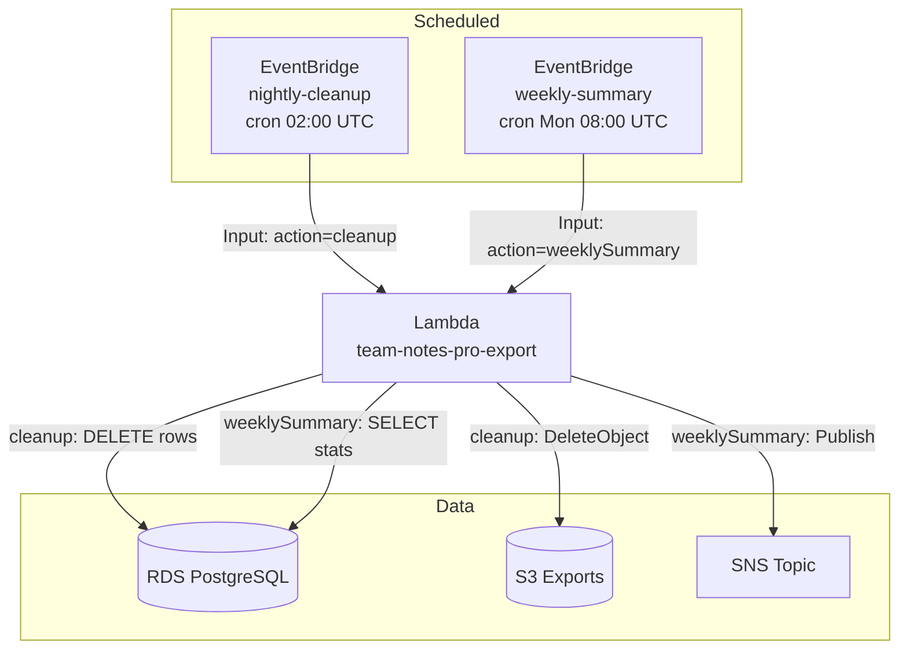

# Stage 9 Deployment: Amazon EventBridge (Scheduled Automation)

## What this stage does

Two recurring jobs run automatically on a schedule:

| Job | Schedule | What it does |
|-----|----------|-------------|
| Nightly cleanup | 02:00 UTC daily | Deletes `export_jobs` DB rows and S3 files older than 7 days |
| Weekly summary | 08:00 UTC Monday | Counts notes across all users, publishes stats to SNS |

Both jobs are new actions in the existing `lambda.js` — no new Lambda function or ECS service. EventBridge invokes the Lambda directly with a fixed JSON payload.

**New AWS service: Amazon EventBridge**

EventBridge is an event bus and scheduler. In this stage we use its **scheduled rules** feature — you give it a cron expression and a target, and it invokes that target on the schedule. The rule fires even if nothing changed; it's a pure time-driven trigger.

---

## Why EventBridge instead of a cron in the worker?

The worker ECS service runs continuously. You could add `setInterval` calls there, but:

- The schedule is tied to the lifetime of the process — if the task restarts, intervals reset
- Scheduling logic is buried in application code rather than visible in AWS
- EventBridge rules appear in the console, have metrics, can be paused/resumed without deploys
- EventBridge retries failed invocations automatically (up to 185 times over 24 hours)

---

## Architecture



---

## Step 1 — Redeploy the Lambda with the new actions

Repackage and upload `lambda.js` which now includes `cleanup` and `weeklySummary`:

```bash
cd team-notes-pro/backend

rm -rf /tmp/lambda-pkg && mkdir /tmp/lambda-pkg
cp lambda.js db.js package.json /tmp/lambda-pkg/
cd /tmp/lambda-pkg && npm install --omit=dev
zip -r /tmp/lambda.zip .

aws lambda update-function-code \
  --function-name team-notes-pro-export \
  --zip-file fileb:///tmp/lambda.zip \
  --query '{state:LastUpdateStatus}' \
  --output json
```

---

## Step 2 — Add s3:DeleteObject to the Lambda IAM role

The cleanup action deletes S3 objects. The existing role only has `s3:PutObject`.

### Console

1. **IAM → Roles** → find `team-notes-pro-export-role-*`
2. Find the inline policy added in Stage 8
3. **Edit** → add `s3:DeleteObject` to the S3 statement:

```json
{
  "Effect": "Allow",
  "Action": ["s3:PutObject", "s3:DeleteObject"],
  "Resource": "arn:aws:s3:::team-notes-pro-exports-<account_id>/exports/*"
}
```

### CLI

```bash
ROLE_NAME=$(aws lambda get-function-configuration \
  --function-name team-notes-pro-export \
  --query 'Role' --output text | sed 's|.*/||')

ACCOUNT_ID=$(aws sts get-caller-identity --query Account --output text)

# Find and update the inline policy — or add a new one
aws iam put-role-policy \
  --role-name "$ROLE_NAME" \
  --policy-name team-notes-pro-lambda-s3-delete \
  --policy-document "{
    \"Version\": \"2012-10-17\",
    \"Statement\": [{
      \"Effect\": \"Allow\",
      \"Action\": \"s3:DeleteObject\",
      \"Resource\": \"arn:aws:s3:::team-notes-pro-exports-${ACCOUNT_ID}/exports/*\"
    }]
  }"
```

---

## Step 3 — Create the EventBridge rules

### Console (recommended)

**Rule 1 — Nightly cleanup:**

1. Open **EventBridge → Rules → Create rule**
2. Name: `team-notes-pro-nightly-cleanup`
3. Description: `Delete export_jobs rows and S3 files older than 7 days`
4. Rule type: **Schedule**
5. Schedule pattern: **Cron-based** → `0 2 * * ? *`
   > Runs at 02:00 UTC every day. The `?` in the day-of-week field is required by AWS cron syntax.
6. Target:
   - Target type: **AWS service**
   - Select target: **Lambda function**
   - Function: `team-notes-pro-export`
   - Configure target input: **Constant (JSON text)**
     ```json
     {"action":"cleanup"}
     ```
7. Click **Create rule**

**Rule 2 — Weekly summary:**

1. **EventBridge → Rules → Create rule**
2. Name: `team-notes-pro-weekly-summary`
3. Description: `Publish weekly notes stats to SNS`
4. Rule type: **Schedule**
5. Schedule pattern: **Cron-based** → `0 8 ? * MON *`
   > Runs at 08:00 UTC every Monday.
6. Target:
   - Lambda function: `team-notes-pro-export`
   - Constant JSON: `{"action":"weeklySummary"}`
7. Click **Create rule**

> When you add a Lambda target in the console, EventBridge automatically adds the `lambda:InvokeFunction` permission to the Lambda's resource policy. No manual IAM step needed.

### CLI alternative

```bash
LAMBDA_ARN=$(aws lambda get-function-configuration \
  --function-name team-notes-pro-export \
  --query 'FunctionArn' --output text)

ACCOUNT_ID=$(aws sts get-caller-identity --query Account --output text)
REGION=us-east-1

# Rule 1 — nightly cleanup
aws events put-rule \
  --name team-notes-pro-nightly-cleanup \
  --schedule-expression "cron(0 2 * * ? *)" \
  --description "Delete export_jobs rows and S3 files older than 7 days" \
  --state ENABLED

# Write targets to files — avoids nested-JSON shell quoting errors
cat > /tmp/target-cleanup.json <<EOF
[{"Id":"LambdaCleanup","Arn":"${LAMBDA_ARN}","Input":"{\"action\":\"cleanup\"}"}]
EOF

aws events put-targets \
  --rule team-notes-pro-nightly-cleanup \
  --targets file:///tmp/target-cleanup.json

# Rule 2 — weekly summary
aws events put-rule \
  --name team-notes-pro-weekly-summary \
  --schedule-expression "cron(0 8 ? * MON *)" \
  --description "Publish weekly notes stats to SNS" \
  --state ENABLED

cat > /tmp/target-summary.json <<EOF
[{"Id":"LambdaWeeklySummary","Arn":"${LAMBDA_ARN}","Input":"{\"action\":\"weeklySummary\"}"}]
EOF

aws events put-targets \
  --rule team-notes-pro-weekly-summary \
  --targets file:///tmp/target-summary.json

# Grant EventBridge permission to invoke the Lambda (required when using CLI)
aws lambda add-permission \
  --function-name team-notes-pro-export \
  --statement-id allow-eventbridge-cleanup \
  --action lambda:InvokeFunction \
  --principal events.amazonaws.com \
  --source-arn "arn:aws:events:${REGION}:${ACCOUNT_ID}:rule/team-notes-pro-nightly-cleanup"

aws lambda add-permission \
  --function-name team-notes-pro-export \
  --statement-id allow-eventbridge-weekly-summary \
  --action lambda:InvokeFunction \
  --principal events.amazonaws.com \
  --source-arn "arn:aws:events:${REGION}:${ACCOUNT_ID}:rule/team-notes-pro-weekly-summary"
```

---

## Testing

Don't wait for the schedule — invoke the Lambda directly with the action payloads:

```bash
# Test cleanup
aws lambda invoke \
  --function-name team-notes-pro-export \
  --payload '{"action":"cleanup"}' \
  --cli-binary-format raw-in-base64-out \
  /tmp/cleanup-result.json && cat /tmp/cleanup-result.json

# Test weekly summary
aws lambda invoke \
  --function-name team-notes-pro-export \
  --payload '{"action":"weeklySummary"}' \
  --cli-binary-format raw-in-base64-out \
  /tmp/summary-result.json && cat /tmp/summary-result.json
```

Expected cleanup response:
```json
{"deletedJobs": 0, "deletedFiles": 0}
```

Expected summary response:
```json
{
  "event": "weekly.summary",
  "totalNotes": 12,
  "totalUsers": 3,
  "newThisWeek": 4,
  "generatedAt": "2026-04-30T10:00:00.000Z"
}
```

If `SNS_TOPIC_ARN` is configured on the Lambda, a summary email also arrives at the subscribed address.

To verify EventBridge rules are firing on schedule, check **CloudWatch → Log groups → /aws/lambda/team-notes-pro-export** — you'll see invocations logged at the cron times.

---

## Cron syntax quick reference

AWS EventBridge cron uses six fields (not five like standard cron):

```
cron(minutes hours day-of-month month day-of-week year)
       0       2       *          *        ?         *     ← every day at 02:00 UTC
       0       8       ?          *       MON         *     ← every Monday at 08:00 UTC
```

| Field | Required | Values |
|-------|----------|--------|
| Minutes | Yes | 0–59 |
| Hours | Yes | 0–23 (UTC) |
| Day-of-month | Yes | 1–31 or `*` or `?` |
| Month | Yes | 1–12 or JAN–DEC |
| Day-of-week | Yes | 1–7 or SUN–SAT or `?` |
| Year | Yes | 1970–2199 or `*` |

You must use `?` in either day-of-month **or** day-of-week (not both) to avoid ambiguity.

---

## Cost estimate

| Resource | Cost |
|----------|------|
| EventBridge rules | Free for scheduled rules |
| Lambda invocations | 2 invocations/day × 30 days = ~60/month — well within free tier |

Both jobs cost effectively nothing.

---

## What's next — Stage 10

Stage 10 adds **CloudWatch, X-Ray, and Alarms**: structured JSON logging throughout the API and Lambda, distributed tracing across ECS → Lambda → RDS, and alarms for error rate and export job failures.
